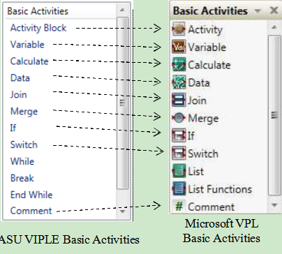
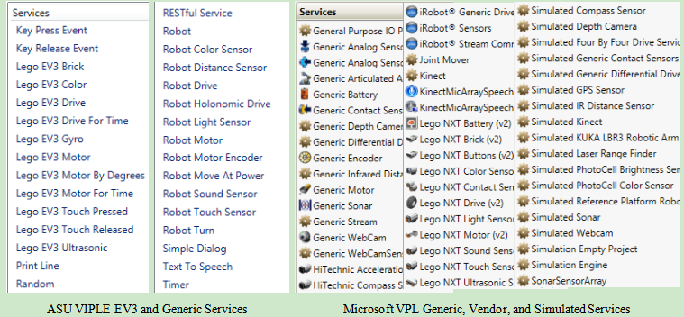

#Chapter 1
#Introduction to ASU VIPLE

ASU VIPLE uses the same computing model as Microsoft VPL. The program is running on a Windows computer, a desktop, a laptop, or a tablet. The computer sends commands to control the  robot actuators (motors) and receives the sensory data and motor feedback from the robot. The data between the computer and the robot is encoded in a JSON object which is in plain text format. It supports Wi-Fi, Bluetooth and USB connections between the main computer and the robot. ASU VIPLE supports EV3 and any self-developed robots. We have developed different robots based on Intel architecture, the Linux operating system, and the Windows operating system.

Figure 1.1 compares the basic activities between ASU VIPLE and Microsoft VPL. VIPLE implemented most basic activities in VPL and implemented additional While, Break, and End While activities to facilitate loop building, which can reduce the circular paths in VPL diagrams.

 

**Figure 1.1.** Activities and services: ASU VIPLE versus Microsoft VPL

As can be seen that VIPLE has similar programming constructs and ca be used for the same kinds of applications using these basic activities.

The usability of a language largely depends on the availability of library functions or called services. Figure 1.2 shows the ASU VIPLE services and Microsoft VPL services. Microsoft VPL  implemented multiple sets of vendor services, including general service, generic robot services, iRobot services, LEGO NXT services, and simulated services. The general services and generic robot services include Log, Text to Speech, SpeechRecognizer, Simple Dialog, Direction Dialog, Timer, etc. VPL many implemented multiple vendor services, such as LEGO NXT services, iRobot services, HiTechnic services, and simulated services.

 

**Figure 1.2.** ASU VIPLE services versus Microsoft VPL services

In the current VIPLE version, three sets of services are implemented only. The first set is a list of general services, including the Simple Dialog, Key Press Event (Direction Dialog), Text To Speech, Print Line (Log), Timer, and RESTful services. The second set of services is for EV3 robots, which correspond to the NXT services in Microsoft VPL. The third set of services are used to connect to generic robots, sensors, and motor services. The general services can be used not only for robots, but also for general purpose applications. The addition of LEGO EV3 services allows the VPL developers who used NXT robots to use the new LEGO EV3 robots. The generic robot services allow the developers to use VIPLE to connect to an open architecture robot. In Microsoft VPL, DSS services developed specifically for MSRDS can be added into the VPL service list. In ASU VIPLE, RESTful services can be accessed in VIPLE diagram. As RESTful services are widely used in today’s Web application development, the access to RESTful services extends the capacity of VIPLE to a wide range of resources. ASU VIPLE does not have simulated serviced at this time. A simulation environment is being implemented.

Many improvements are made in ASU VIPLE. For example, ASU VIPLE use state.varaible consistently. In VPL, local variables (the location of a variable’s use has a direct link to the variable) use variable name only, while and global variables use state.variable syntax. It is not easy for inexperienced programmer to recognize the scope of variables and often causes confusion.