#Chapter 2
#Essentials in ASU VIPLE

Download ASU VIPLE software, sample codes, and tutorial at:
 [http://example.com/](http://example.com/).

Unzip and open the folder Release, start the ASU VIPLE software from the file: VisualProgrammingEnvironment. Now, you can learn ASU VIPLE by following the tutorial exercises.

ASU VIPLE is general purpose programming language and is turning-complete in its capacity. It can be used for any kind of computation  tasks.  In ASU VIPLE, A  program is  represented  as a diagram of workflow, and the components are defined as activities in the diagram. We will learn the language through a series of examples and exercises.

##2.1  Basic Constructs in ASU VIPLE

There are 10 basic activities that can be used for constructing programs. These activities are briefly explained in Figure 2.1, and they will be exercised in the following programming exercises.

 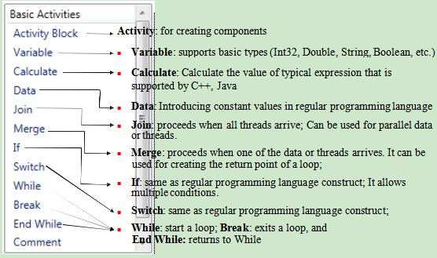

**Figure 2.1.**Basic Activities in ASU VIPLE

###Exercise 1. Hello World in ASU VIPLE
ASU VIPLE is similar to Microsoft VPL not only in concepts but also in programming. It is our intention to have Microsoft VPL programmers use ASU VIPLE with little learning. We now show examples of basic programming in ASU VIPLE. We start with the Hello World program. Figure 2.2 shows the two versions of code using VPL and ASU VIPLE. The two diagrams look the same. However, ASU VIPLE has simplified a couple of steps: it automatically changes the type to String after a string is entered, and the default null value step in Microsoft VPL is eliminated.

 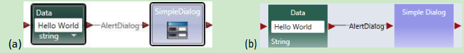

**Figure 2.2.** Hello world program in (a) Microsoft VPL and (b) ASU VIPLE

###Exercise 2. Input and Output in ASU VIPLE
Now, we use ASU VIPLE to implement the examples that we have implemented Microsoft VPL in the previous sections. Simple Dialog service in ASU VIPLE can be used for both input and output. The diagram in Figure 2.3 uses Simple Dialog for input first. The connection type is PromptText.  The following three dialog boxes in Figure 3 show examples of the data connection, input prompt when executing the code, and the output. The same diagram also uses Simple Dialog for output when the connection type is set to AlertDialog.

 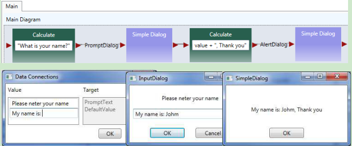

**Figure 2.3.** Using Simple Dialog to perform input and output

###Exercise 3. A Simple Counter in ASU VIPLE

Now, we can implement a simple counter in ASU VIPLE diagram, as shown in Figure 2.4. A similar implementation of the counter activity in Microsoft VPL can be found in our VPL tutorial.

 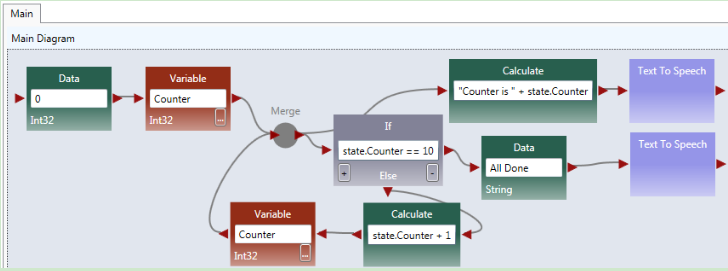

**Figure 2.4.** A simple counter

###Exercise 4. Using While-Loop to implement Counter
We formed a loop by ourselves in the previous exercise. We can use a built-in loop in ASU VIPLE to make the program structure simpler. The diagram is shown in Figure 2.5.

 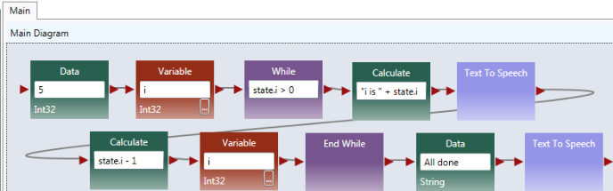 

**Figure 2.5.** Using while-loop for implementing the counter

Quiz: What is the main different between this counter and the counter in the previous exercise?

##2.2Activity and Parameter Passing in ASU VIPLE

Basic Activity and Activity are building blacks of diagrams or flowchart. Data transfer between the activities are through global variables and parameter passing.

###Exercise 1. Activity and Parameter Passing
In this exercise, we create a simple main and an activity. We illustrate the communication between the main and the activity through (2) global variables and (2) parameter passing.

In the program, String value Yinong Chen is assigned to OutVariable and the value is passing into the activity. The String value Hello is passed into the activity through the input put of the activity. The return value of the activity is assigned the output port and passed back to the Main diagram. Notice that the variables are global, and the Main diagram can also access the innerVariable to retrieve it value.

 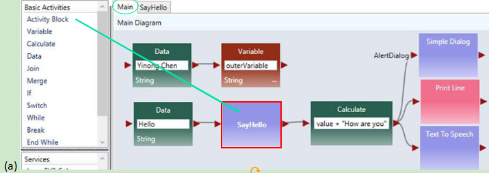

 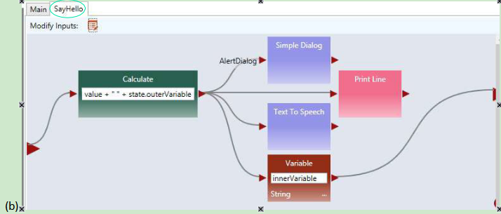

**Figure 2.6.** (a) Main diagram and (b) an activity

To use parameter passing, we need to define a parameter for the activity, and use “value” as the data connection to the activity, as shown in Figure 2.6 (c). The Main diagram and the activity code are given Figure 2.6(d).

 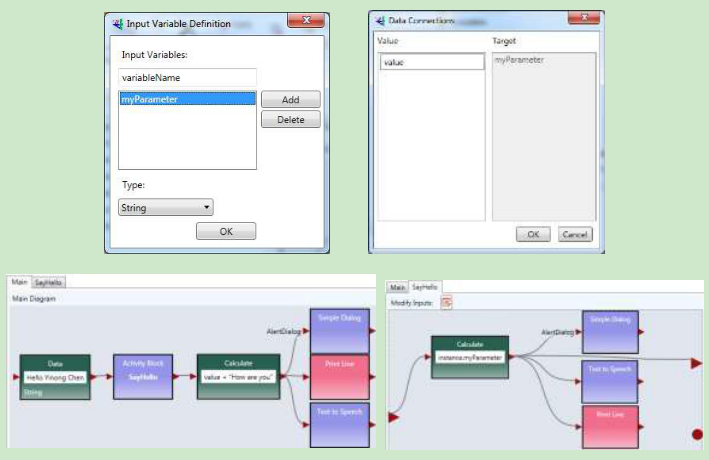

**Figure 2.6.** (c) Define a parameter and (d) Main diagram and SayHello activity

###Exercise 2. Counter as an Activity in ASU VIPLE

As a more complex example, Figure 2.7 shows the ASU VIPLE program that implements: (a) a Main diagram and (b) a counter activity. The activity takes an input N in the main diagram. In the activity CountToN, it starts from 0 and adds 1 in each iteration. It stops when the counter value is equal to N. Text to Speech service is used to read out the numbers in the activity, and Simple Dialog Service is used to print the counted numbers. As can be seen in the activity diagram, both data output and notification (event) are supported in ASU VIPLE. A similar implementation of the counter activity in Microsoft VPL.

 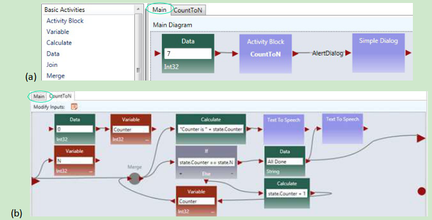

**Figure 2.7.** ASU VIPLE program example: (a) main program and (b) activity

Quiz: What is the main different between this counter and the counter in the previous two exercises?

##2.3Implementing finite state machine and event-driven programming

Although ASU VIPLE can be used as a general programming language, its strength is in event-driven programming that can response to a sequence of events. The event-driven applications are best described by finite state machines consisting of states and transitions between the states. The transitions are triggered by events. We will start to use ASU VIPLE for solving event-driven problems.

###Exercise 1. Implement a Vending Machine

Given a Finite State Machine (FSM) in Figure 2.8, we first implement the requirement of the vending machine without using event-driven programming.

 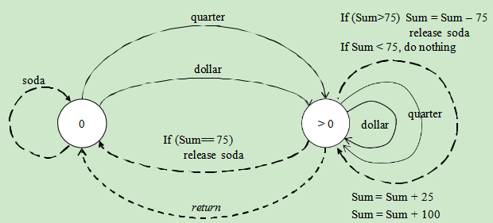

**Figure 2.8.** Finite State Machine of a vending machine

A sample VIPLE diagram is shown in Figure 2.9. We use Simple Dialog to take input

 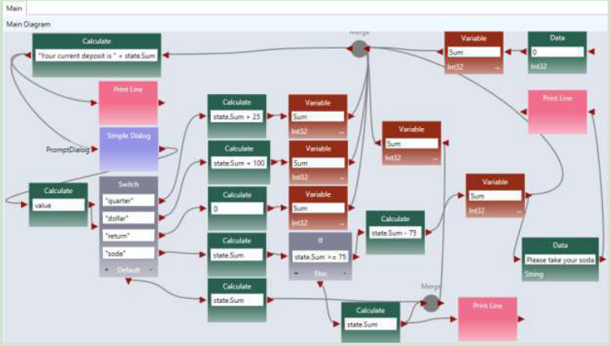

**Figure 2.9.**  ASU VIPLE program of the vending machine

###Exercise 2. Implement the Vending Machine Using Events

Change the program to use the Key Press Event as the inputs (triggers) of the finite state machine. Use

* q for quarter

* d for dollar

* r for return

* s for soda

 

###Exercise 3. Garage Door Opener (part 1)

Given a Finite State Machine (FSM) in the following diagram, implement a simulated garage door control logic in ASU VIPLE.

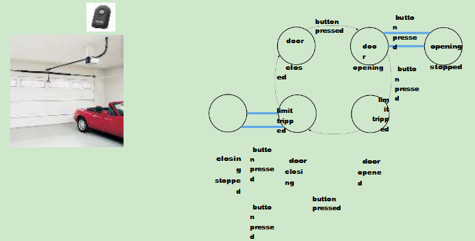

**Figure 2.10.**  Finite state machine of a garage door opener

The remote controller is a touch sensor or a key press event, and the limit sensor is a build-in sensor in the motor. When the door stop, the limit sensor will generate a notification. You can start your program similar to the maze navigation program we learned in Microsoft VPL, as shown in the diagram below.

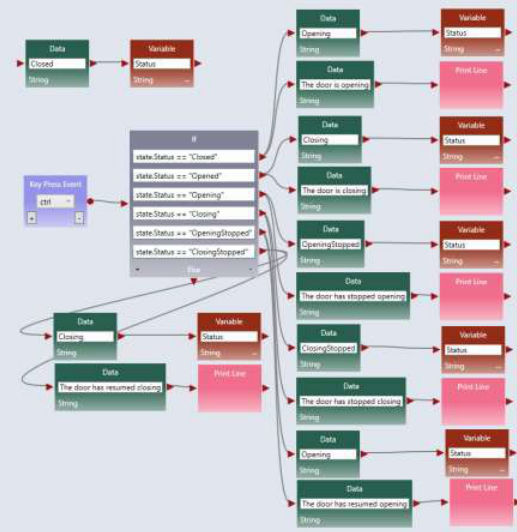

**Figure 2.10.**  ASU VIPLE program (part 1) of the garage door opener

###Exercise 4. Garage Door Opener (part 2)
The limit sensor built-in the motor can be simulated as follows. When key m is pressed while the door is opening or is closing, the state will change and result will be displayed.

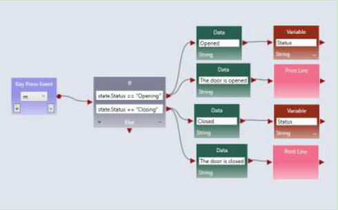

**Figure 2.11.**  ASU VIPLE program (part 2) of the garage door opener

At this time, ASU VIPLE does not have the simulated sensors and simulated drive (motors), we have to use key press event and Print Line to simulate the sensors and motors.

###Exercise 5. Parity Detection

Given a Finite State Machine (FSM) in the following diagram, implement a simulated parity detection logic in ASU VIPLE. The program must generate a 1 output if the number of 1s entered is an even number, otherwise, it must generate a 0 output. You can use the key press events to simulate the inputs 0s and 1s.

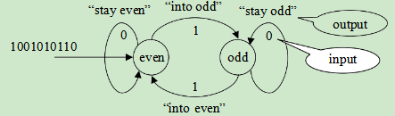

**Figure 2.12.**  Finite state machine for parity detection

One of the purposes of ASU VIPLE is to extend Microsoft VPL to more conveniently support EV3 and other physical robots. In the rest of the section, we will focus on using ASU VIPLE to connect to different physical robots. We start with the drive-by-wire program that controls the robot using the keyboard of the computer. Then, we will discuss the autonomous programs that control robots to navigate through the maze without any human intervention.