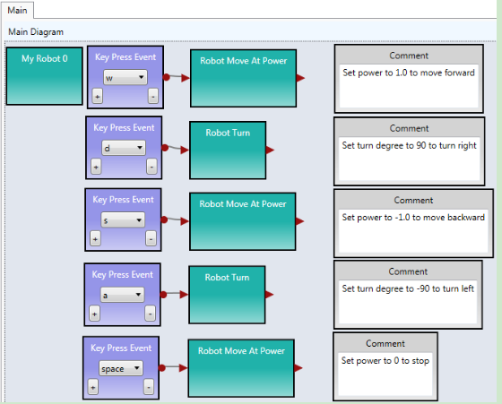
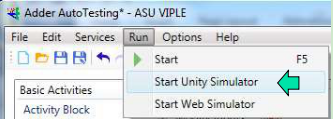

#Chapter 3
#Controlling Simulated Robots Using ASU VIPLE

In this section, we will write ASU VIPLE programs to control simulated robots.

##3.1VIPLE Robot Services
VIPLE is a programming environment with general-purpose functions, as well as IoT/Robotic specific functions. Three sets of services are implemented: General computing services, generic robotic services, and vendor-specific robotic services.

* General computing services: include input/output services (Simple Dialog, Print Line, Text To Speech, and Random), Event services (Key Press Event, Key Release Event, Custom Event, and Timer), and Web services (RESTful services and WSDL services), as shown in the first part of Figure 3.1. Most of the basic library functions supported in C# can be called in the data box of Calculate activity. Timer service takes an integer i as input, and it will hold data flow for i milliseconds. Timer service is frequently used in the robotic applications.
* Generic robotic services: VIPLE offers a set of standard communication interfaces, including Wi-Fi, TCP, Bluetooth, USB, localhost, and WebSocket interfaces. The data format between VIPLE and the IoT/Robotic devices is defined as a standard JSON (JavaScript Object Notation) object. Any robot that can be programmed to support one of the communication types and can process JSON object can communicate with VIPLE and be programmed in VIPLE. As shown in the second part of Figure 3.1, all VIPLE services that start with Robot are generic robotic services. We will use these services to program our Simulated robots and custom-built physical robots.
* Vendor-specific services: Some robots, such as LEGO robots and iRobots, do not offer an open communication and programming interfaces. In this case, we can offer built-in services in VIPLE to access these robots without requiring any programming efforts on the device side. Currently, the services for accessing LEGO EV3 robots are implemented, so that VIPLE can read all EV3 sensors and control EV3 drive-motors and arm-motor, as

shown in the third part in Figure 3.1. For those who do not want to build their own robots can simple use VIPLE and EV3 combination.

**Figure 3.1.** List of general services, generic robotic services, and EV3 services in VIPLE

In text, we will use generic robotic services to program simulated and physical robots. We will focus simulated robots in this chapter. We program the Intel-based physical robots and EV3 robots in the next two chapters. The robotics services are explained as follows.

* **Robot** service is used for defining the connection types, connection port, and connection addresses. Multiple Robot services can be used in one application to control multiple robots. For each motor service and sensor service used, a partner Robot need to be selected.
* Robot Motor and Drive services. A number of services are defined for controlling different types of motors defined on the devices. Which services to use are determined by the physical device that are programmed to connect to VIPLE, and they should be specified in device hardware manual.
 + **Robot Motor:** It controls a single motor. It requires to set up a partner Robot, a motor port number, and a drive power value between 0 and 1.0. The bigger the value, the faster the motor rotates. Positive and negative values are allowed, which will cause the motor to rotate in opposite directions.
 + **Robot Motor Encoder:** It is the same as Robot Motor, but it is of motor encoder type.
 + **Robot Drive:** Control two motors at the same time for driving purposes. It requires setting up a partner Robot, two motor port numbers, and two drive power values. The bigger the values, the faster the motors rotate. Positive and negative values are allowed. If two identified positive values are given, the robot moves forward. If two identified negative values are given, the robot moves backward. If one bigger value and one smaller value, or one positive value and one negative value are given, the robot turns left or right.
 + **Robot Holonomic Drive:** Control four motors at the same time for holonomic driving purposes, such as controlling a drone. It requires to set up a partner Robot, four motor port numbers, and three drive values for X component, Y component, and rotation.
 + **Robot+ Move at Power:** It requires to set up a partner Robot and a drive power value between 0 and 1.0 to move both wheels of robot forward (positive value) or backward (negative value). The motor port numbers are not required to specify (hard coded in the device). This service can be used in the simulated robot.
 + **Robot+ Turn by Degree:** It requires to set up a partner Robot and a degree value between 0 and 360. The motor port numbers are not required to specify (hard coded in the device). This service can be used in the simulated robot.

* **Robot sensors:** A number of sensor services are defined for reading data from the device, including color sensor, distance sensor, light sensor, sound sensor, and touch sensor. Each sensor requires to set up a partner Robot and a port number.

##3.2Implementing Maze Navigation Algorithms in Robotics Simulation

To program a robot to navigate through a maze, we need to choose or design an algorithm first. Different algorithms exist. They have different complexity and performance. The complexity of a computational algorithm is typically measured by the number of steps the algorithm needs to perform in the worst case. However, the maze navigation algorithms involve robot’s movements and turns. They involve mechanical operations, which are orders of magnitude slower than program execution steps. Thus, the main criteria for evaluating the maze navigation algorithms are the arc degree of robot’s turning and the distance of robot’s travelling.

We start with simple algorithms in a simple simulation environment (eRobotic), as shown in Figure 3.2: Right-wall-following algorithm and two-distance local best algorithm.

The eRobotics environment runs in the Web browser at the address:http://venus.eas.asu.edu/WSRepository/eRobotic/
[http://venus.eas.asu.edu/WSRepository/eRobotic/](http://venus.eas.asu.edu/WSRepository/eRobotic/).

In the given maze, it takes longer time for the right-wall-following algorithm to find the exit of maze.

**Figure 3.2.** Simulated maze, right-wall-following and farthest distance algorithms

The right-wall-following algorithm can be described in the following steps:

1. Robot moves forward;
2. If sensor.right distance > 100, delay and then turn 90 degree to the right;
3. Else sensor.forward distance < 50, turn 90 degree to the left;
4. Return to step 1.

The simulated farthest distance algorithm can be described in the following steps:

1. Robot move forward;
2. If sensor.forward > 50, continue to move forward;
3. If sensor.left distance < sensor.right distance, then turn 90 degree to the right;
4. If sensor.left distance > sensor.right distance, then turn 90 degree to the left;
5. Return to step 1.

We can also easily implement a one-distance-first-working-solution algorithm as follows:

1. Robot move forward
2. If sensor.forward > 50, continue to move forward;
3. If sensor.right distance > 100, then turn 90 degree to the right;
4. If sensor.right distance < 50, then turn 90 degree to the left;
5. Return to step 1.

These algorithms are so simple that we do not need to use any states or variables. The reasons for the simplicity are as follows:

* The eRobot in Figure 3.2 has three distance sensors in front, left and right. It can make the decision based on three distances. If there is one distance in the front only, the robot will have to rotate to measure the distances on the other sides. Then, it will need to have a variable to save the previous distance.
* The eRobot in Figure 3.2 can move forwards and turns with 100% accuracy. If the motors are not accurate in moving straight or turning, the algorithm must consider the adjustment and compensation to correct the errors, which will requires states and variables.

In the reality, the motors are not accurate and not consistent. They cannot move in straight line and cannot turn the desired degrees. The drop-down list language in the eRobotics environment does not support states and variables, and it is not capable of simulating the physical robots that we will use in our experiments.

The Unity simulator is a more powerful simulation environment that can simulate more conditions. It works with VIPLE, which is a much more powerful programming language supporting variables, data, calculation, and various control structures. In this lab, we will use VIPLE and Unity simulator to implement various maze navigation algorithms that mimic more realistic situations.

##3.3Maze Navigation Algorithms Using Finite State Machine

Since our physical robot will have one distance sensor installed, we will define the algorithms in this section use one distance sensor only. The sensor is assumed to be installed in the front of the robot. We will use finite state machines to describe the maze navigation algorithms.

**First-Working-Solution Algorithm**

The first-working-solution algorithm is an algorithm that instructs a robot to move in the first direction that has a distance great than a given constant.  Figure 3.3 shows the finite state machine of this algorithm. The finite state machine consists of four states. The robot starts with “Forward”. If the front distance becomes less than a given value, the robot starts “Turning Left” 90 degrees. After “Turned Left”, the robot compares the distance sensor value. If it is big enough, the robot enter “Forward” state. Otherwise, it spins 180 degree back to the other direction and then moves forward.

**Figure 3.3.** Finite state machine for the first-working-solution algorithm

**Two-Distance-Local-Best Algorithm**

The first-working-solution algorithm may not perform well in certain mazes. Figure 3.4 shows the two- distance-local-best (farthest distance) algorithm.

**Figure 3.4.** Finite state machine for the two-distance-local-best algorithm

Instead of comparing the left-side distance with a constant, it compares the left-side distance with right- side distance, and then moves to the side with farther distance. This finite state machine adds two states to include “Turning Right” and “Turned Right”. It also uses a variable to hold the RightDistance. Recall that the robot is assumed to have one distance sensor only. It has to store the right-side distance before it measures the left-side distance.

**Self-Adjusting Right-Wall-Following Algorithm**

Figure 3.5 shows the finite state machine for the self-adjusting right-wall-following algorithm. It assumes that there are two distance sensors, one in the front and one on the right side. The front sensor could be replaced by a touch sensor. The finite state machine uses two variables: Status and BaseDistance to the right wall. BaseDistance is initialized to a desired value to keep the robot in the middle of the road.

The robot starts with moving forward. It keeps the base distance with the right wall. If the distance to the right wall is too big (base distance+5), it turns one degree to right to move closer to the wall. If the distance to the right wall is too small (base distance -5), it turns one degree to left to move away from the wall.

If the right distance suddenly become very big (base distance+400), it implies that the right side is open and the robot should turn right 90 degree to follow the right wall.

If the front distance becomes too small (<200), it implies that no way in the front and no way on the right, thus, the robot has to turn left 90 degree.

**Figure 3.5.** Finite state machine for the self-adjusted right-wall-following algorithm

The performance of maze these navigation algorithms depends on the maze too. If we apply these three algorithms in the mazes shown in Figure 3.6, which algorithm will perform the best?

**Figure 3.6.** Different mazes can impact the performance of navigation algorithms

##3.4Lab Assignments in Unity Simulator

Now, you are ready to take the online pre-lab quiz. You must complete the quiz before you attend the lab. In this chapter, you will start with implementing autonomous maze navigation algorithms using the Unity Simulator.

Before you start programming, please download a new version of VIPLE from:
http://neptune.fulton.ad.asu.edu/VIPLE/
[http://neptune.fulton.ad.asu.edu/VIPLE/](http://neptune.fulton.ad.asu.edu/VIPLE/).

###Exercise 1. Drive-by-wire simulation

We have been using VIPLE for general programming in flow control style and in event-driven style. These preparations are necessary for fulfilling our main purpose of programming IoT and robotics applications.

In the rest of the section, we will focus on robotics application development using both simulated and physical robots. We start with the drive-by-wire program that controls the robot using the keyboard of the computer. Then, we will discuss the autonomous programs that control robots to navigate through the maze without any human intervention.

A number of robot services are implemented in VIPLE to facilitate different robots

**Step 1:** First, drag and drop the service “Robot” in the diagram. Right click the robot to use the following configurations (1) In Set TCP Port: set port number to 1350, In Properties: choose localhost, and in Connection Type: choose Wi-Fi, as shown in Figure 3.7.

**Figure 3.7.** Configuration of the Robot service for simulation

**Step 2:** Now, we can write the drive-by-wire code as shown in Figure 3.8. You can follow the comments to sect the data connection values. You can find the services in the VIPLE service list.

**Figure 3.8.** Basic drive-by-wire diagram

You must right click each Robot Move or Robot Turn activity and choose “My Robot 0” as the partner.

When you start the code, you will not see anything happening. We need a simulator or a real robot to see the robot controlled by the code. We will a simulator at this time and use a real robot later.

**Step 3:** Start the Unity simulator in VIPLE by choosing the VIPLE menu Run -> Start simulator. Figure 3.9 shows the VIPLE start command and the simulated maze environment and the robot. Now, you can drive your robot using the five keys: w, d, a, s, and space. You can also change the maze by mouse- clicking the maze area to add and remove bricks.

**Figure 3.9.** The simulation environment

When you are done, please notify your lab instructor and demonstrate your program for sign-off. Then change the driver to proceed to the next assignment.

###Exercise 2. Understanding the VIPLE Diagram

Read the VIPLE diagram given in Figure 3.10 and answer the following questions.

**Figure 3.10.** Main diagram of a maze navigation algorithm

1. What algorithm does this VIPLE diagram implement?
2. What states does this diagram use?

Hint, there two types of variables: (1) variables with a fixed (finite) number of possible values and (2) variables with unlimited number of values, such as integer or double. The finite state machine uses those variable’s values as states that have fixed (finite) numbers of possible values.
3. Draw the finite state machine of this diagram.

Hint: After you have decided the states in the previous question, now you can add transitions and the input and output related to each transition to form the finite state machine.
4. What values should be given to the Robot Move and Robot Turn services in order to complete the algorithm?

When you are done, please notify your lab instructor and demonstrate your program for sign-off. Then change the driver to proceed to the next assignment.

###Exercise 3: Implement the VIPLE Diagram in Unity Simulator

*Draw Diagram in VIPLE. Make sure you configure the Robot, sensor, and motor services with the following values.*

Right click the robot to use the following configurations: (1) In Set TCP Port: set port number to 1350; In Properties: choose localhost; and in Connection Type: choose Wi-Fi.

Right click each Move service and choose “My Robot 0” as the partner. If you use the Robot+ Move at Power and Robot+ Turn by Degree services, you do not need to set the port numbers.

Right click each Distance Sensor service, choose “My Robot 0” as the partner. Set Port to 1 for right sensor and set to 2 for the front sensor.

*Start the Simulator and run the diagram. Adjust the values given to the Robot Move and Robot Turn services to make the program work.*

Draw Diagram in VIPLE. Make sure you configure the Robot, sensor, and motor services with the following values.

Right click the robot to use the following configurations: (1) In Set TCP Port: set port number to 1350; In Properties: choose localhost; and in Connection Type: choose Wi-Fi.

Right click each Move service and choose “My Robot 0” as the partner. If you use the Robot+ Move at Power and Robot+ Turn by Degree services, you do not need to set the port numbers.

Right click each Distance Sensor service, choose “My Robot 0” as the partner. Set Port to 1 for right sensor and set to 2 for the front sensor.

Start the Simulator and run the diagram. Adjust the values given to the Robot Move and Robot Turn services to make the program work.

Follow Figure 3.6 to change the maze and test the effectiveness of the algorithm.

When you are done, please notify your lab instructor and demonstrate your program for sign-off. Then change the driver to proceed to the next assignment.

###*Exercise 4: The Activities of the Two-Distance-Local-Best Algorithm*

In this section, you will implement the two-distance-local-best algorithm. Its finite state machine is shown in Figure 3.4.

You will use modularized code to implement the algorithm. First, you create the activities needed, as shown in Figure 3.11

**Figure 3.11. Activities needed in the Main diagram**

The code for the activities are given in Figure 3.12. The code for turning Left180 and for Right180 is the same, except the turning degree is set to -180.0 and 180.0, respectively. The timer is used for delay the next operation for stability.

**Figure 3.12.** The code of the activities

Right click the Robot service to use the following configurations: (1) In Set TCP Port: set port number to 1350; In Properties: choose localhost; and in Connection Type: choose Wi-Fi.

Right click each Move and Sensor service and choose “My Robot 0” as the partner.

When you are done, please notify your lab instructor and demonstrate your program for sign-off. Then change the driver to proceed to the next assignment.

###*Exercise 5: The Main Diagram of the Two-Distance-Local-Best Algorithm*

Following the finite state machine, the first part of the Main diagram is given in Figure 3.13.

**Figure 3.13.** The first part of the Main diagram

The second part that is connected to the first part is given in Figure 3.14.

**Figure 3.14.** The second part of the Main diagram

*Start the Simulator and run the diagram.*

Follow Figure 3.6 to change the maze and test the effectiveness of the algorithm. Is this algorithm more efficient than the wall-following algorithm?

When you are done, please notify your lab instructor and demonstrate your program for sign-off.

##3.5 Lab Assignments in Web Simulator

In this lab assignment, you will start with implementing autonomous maze navigation algorithms using the Web Simulator.

###*Exercise 1: Web Simulator*

The Web Simulator implemented in VIPLE uses a different set of drive services. These services are the same as the services to be used in the physical robot, and thus, the programs written in the Web Simulator can be easily applied to the physical robot. The changes need to be made is the parameter values controlling the turning times.

The Web simulator can be downloaded from VIPLE site or directly started from: http://neptune.fulton.ad.asu.edu/VIPLE/WebSimulator/
You can also start the Web Simulator from VIPLE, as shown in the left part and the maze opened in the browser is shown on the right side of Figure 12.

The simulator is equipped with two ultrasonic distance sensors and one touch sensor, and you can use choose to have the sensor in the front, left, right or back of the robot, as shown in Figure 13. The port numbers of the sensor is defined in your VIPLE code. You can choose any number as the port number. If you use one sensor only, you must set the port number of the second senor to none. Click Add/Update Sensors after you have defined your sensors.

Note, due a security block in IE browser, the Web Simulator may not be able to communicate with VIPLE. Use Chrome or Firefox if they are available on your computer or phone.

**Figure 12.** Maze of the Web Simulator

Please read the instruction on the simulator page on the configuration requirements to connect VIPLE program.

**Figure 13.** Sensor setting of the Web simulator

When you are done, please notify your lab instructor and demonstrate your program for sign-off. Then change the driver to proceed to the next assignment.

###*Exercise 2: Configuring VIPLE to Use Web Simulator*

Now, you can go back to VIPLE. You can use the same drive-by-wire code that you used with Unity Simulator. However the configuration will be different.

**Step 1:** Right click My Robot to use the following configurations (1) In Change Connection Type: choose WebSocket Server. (2) In Change TCP Port: set port number to 8124, as shown in Figure 14.

**Figure 14.**  Configuration of the Robot service for simulation

**Step 2:** Use the drive-by-wire code that you used with Unity Simulator. After you start “Run: the VIPLE code, you need to go back to the Web browser and click “Connect to ASU VIPLE (WebSockets), as shown in the left part of Figure 15. This operation will connect your Web Simulator to VIPLE.

**Step 3:** Go back to your VIPLE code, click the console window (Run window), as shown in the right part of Figure 15. Only if the Run window is in the front, can the Key Press take effect. Now, you can use the keys to control the robot to move. The keys are programmed in your VIPLE code using Key Press events.

**Figure 15.** Connect the Web Simulator with VIPLE program and Run window

When you are done, please notify your lab instructor and demonstrate your program for sign-off. Then change the driver to proceed to the next assignment.

###*Exercise 3: Implement Wall-Following Algorithm in Web Simulator: Main Diagram*

We first implement the right-wall-following algorithm. The Main diagram is given in Figure 16. For My Robot 0, the connection type must be WebSocket Server and the TCP Port is 8124, as shown in Figure 14. Two sensors are used in the program. A distance sensor is used on the right hand side to measure the distance to the wall. A touch sensor used used in the front to detect the wall. The sensors must configured as follows:

* Right click Robot Distance Sensor and set Partner to My Robot 0 and Port number to 1.
* Right click Robot Touch Sensor and set Partner to My Robot 0 and Port number to 2.

**Figure 16.** Main diagram implementing the right-wall-following algorithm

When you are done, please notify your lab instructor and demonstrate your program for sign-off. Then change the driver to proceed to the next assignment.

###*Exercise 4: Implement Wall-Following Algorithm in Web Simulator: Activities*

Now, we need to implement the Activity diagrams to be called in the Main diagram.

**Step 1:** Figure 19 shows the code for Init activity, which initializes the two variables and set the robot moves forward. There is no output from this activity.

**Figure 17.** The Init Activity

**Step 2:** Figure 18 shows the implementation of the Right90 activity. Right click the motor and select the data connection. The data connection values for the two drive services are shown in lower part of the figure. The first set of values cause the robot to turn right and the second set of values cause the robot to stop.

**Figure 18.** Right90 Activity and Data Connection

**Step 3:** You can follow the code for Right90 to implement Left90 by reversing the power on the wheels.

**Step 4:** Figure 19 shows the implementation of the Backward and Forward activities. For the Backward activity, the drive power can be set to -0.3 for both wheels. For the Forward activity, the drive power can be set to 0.5 for both wheels.

**Figure 19.** Backward and Forward Activities

**Step 5:** Figure 20 shows the code of for ResetState.

**Figure 20.** ResetState Activity

**Step 6:** Now you can the wall-following algorithm in Web Simulator. Use the following steps to test the program.

*Step 1: Start the Web Simulator*

*Step 2: Start to run VIPLE program.*

*Step 3: Step: Set up the sensor values in the Web Simulation.* 

*Step 4: Click “Add/Update Sensors”*

*Step 5:Click Connect to ASU VIPLE (WebScokets).*

If you use a Key Press event to star the move, you need to click the VIPLE’s Run window and use the key to star the move.

When you are done, please notify your lab instructor and demonstrate your program for sign-off. Then change the driver to proceed to the next assignment.

###*Exercise 5: Implement Two-Distance-Local-Best Algorithm in Web Simulator: Main*

*The Two-Distance-Local-Best Algorithm uses one distance sensor in the front of the robot, and thus, it need to turn the body of the robot to measure the distance on the right and then on the left.*

The main diagram will be similar to the code for  the Unity Simulator.  The differences are in  the parameter values. Figure 21 shows the first part and Figure 22 shows the second part of the Main diagram.

**Figure 21.** The first part of the Main diagram

**Figure 22.** The second part of the Main diagram

When you are done, please notify your lab instructor and demonstrate your program for sign-off. Then change the driver to proceed to the next assignment.

###*Exercise 6: Implement Two-Distance-Local-Best Algorithm in Web Simulator: Activities*

You can write the code of the activities in the same way as the code for the wall-following program. For the Init activity, you do not have the baseDistance variable to initialize. For the Left180 activity, you can start from Left90, and use longer time to make 180 degree.

Right Click the Robot Distance Sensor to set the Port to 3, and configure the Web Simulator in the Web browser accordingly. Since this program uses one sensor only. Set the second sensor to none.

Follow the same process to test the code, as you did in testing the wall-following algorithm. When you are done, please notify your lab instructor and demonstrate your program for sign-off.