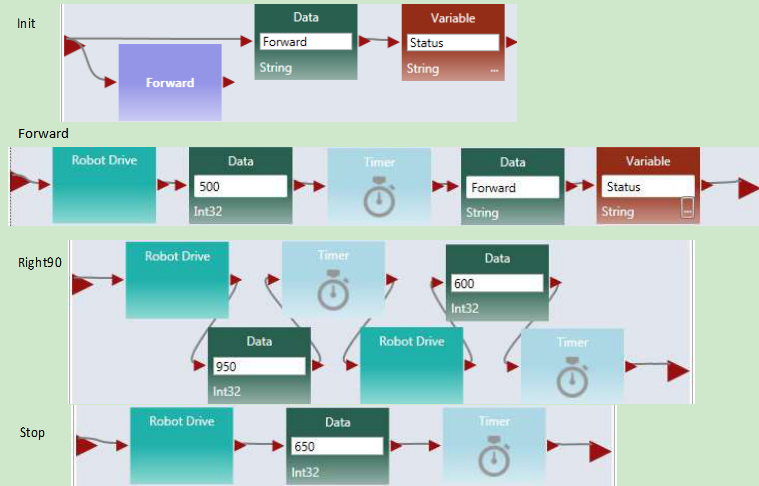

#Chapter 4
#Programming Intel Robots Using ASU VIPLE

In this section, we will write ASU VIPLE programs to control self-built open architecture robots. We have built a robot using Intel Edison board with Linux operating system.

##4.1Constructing and configuring your robot

###Exercise 1. Build Your Robot

This exercise depends on what have been preinstalled. The followings show the steps needed if nothing is preinstalled.

To assemble an Intel Edison robot, you can start with the instructions to install software on an Edison processor with an Arduino breakout board: [https://software.intel.com/en-us/assembling-intel-edison-board-with-arduino-expansion-board](https://software.intel.com/en-us/assembling-intel-edison-board-with-arduino-expansion-board).

For constructing the robot part, you can follow the instructions given by your instructor. The following links shows two of the Edison robots built at ASU

* Sample robot in ASU VIPLE site:  [ http://neptune.fulton.ad.asu.edu/VIPLE/]( http://neptune.fulton.ad.asu.edu/VIPLE/).

The software installed on the Edison robot is listed as follows:

where, the file run.sh is the script to start the program on the robot. We need to start this file before ASU VIPLE can communicate the robot. The file main.js is a JavaScript program that performs most of the work on the robot. It establishes the connection with the Wi-Fi router, displays the IP address on the screen, and waits for the host computer to connect. Notice that the Edison robot and the host computer must connect to the same router. The main.js program also interprets the JSON packets from the host computer and sends the commands to the motors. The folder node_modules contains the library functions that support the scripts in main.js. The folder ArduinoFiles contains the code that read the sonic sensor to obtain the distance value measured by the sensor.

ASU VIPLE supports an open  interface to other robot platforms.  Any robot that  follows the same interface and can interpret the commands from ASU VIPLE program can work with ASU VIPLE. ASU VIPLE program communicates with the robot using the following JSON object, which defines the input to the robot from the ASU VIPLE program and the output from the robot to the ASU VIPLE program.

The ASU VIPLE environment will encode the control information into this object. The robot needs to interpret the script and perform the actions defined. On the other hand, the robot will encode the feedback in the same JSON format, send that back to the ASU VIPLE program, and the ASU VIPLE program will extract and use the information to generate the next actions.

Sponsored by the Intel IOT Group, a number of robots based on Intel architecture, including Intel’s Galileo, Bay-Trail, and Edison, have been developed. ASU VIPLE can connect to these robots via Wi-Fi or Bluetooth, send commands to them, and control them to perform different tasks.

ASU VIPLE implemented two types of robots: EV3 robots and generic robots. A generic robot is a robot that can communicate with the computer running ASU VIPLE and can process the JSON packet.

###Exercise 2. Starting the Program on Edison Robot

This exercise assumes that no starting script is given and manual steps are required. Then, the followings are the steps need to be done before your ASU VIPLE program can control the Edison robot.

1. Installed Edison driver program on the computer that will communicate with the Edison board.
2. Turn on the Edison board power and motor power.
3. Wait for the robot to connect to the default router and to display the IP address.
4. Start SSH from the host computer to log into the Edison using the displayed IP address.
5. Enter the Edison’s user name, e.g., root
6. Enter the Edison’s Password, e.g., password
7. Use SSH shell command to start the program by executing ./run.sh

If the IP address does not appear on the screen of the robot, you can perform the following steps to find the IP address of the robot.

1. Connect robot to the host computer using a USB cable;
2. Start SSH from the computer to log onto the Edison using this IP Address: 192.168.2.15
This can only be done from a computer that has been set up according to these instructions: [https://software.intel.com/en-us/connecting-to-intel-edison-board-using-ethernet-over-usb](https://software.intel.com/en-us/connecting-to-intel-edison-board-using-ethernet-over-usb).
4. Password, e.g.: password
5. Find your IP Address using ifconfig command OR force it to display on the screen by running this command: python ip.py
6. If you need to connect to a new network, you can configure the WiFi on the Edison using this command: configure_edison --wifi
Full  instructions  for  doing  so  are  here: [https://software.intel.com/en-us/connecting-your-inteledison-board-using-wifi](https://software.intel.com/en-us/connecting-your-inteledison-board-using-wifi).

Additional note:

 Each time you want to connect to the Edison from ASU VIPLE you need to re-run the script (./run.sh). Each script run only accepts one connection, after which it won't be able to accept another connection.

###Exercise 3. Pairing Edison Robot with the host computer

To connect a robot to ASU VIPLE program, the computer running the ASU VIPLE program needs to pair with the robot.

As long as a robot can (1) establish a Wi-Fi or Ethernet connection with the computer running the ASU VIPLE program, (2) encode the information into the JSON object, and (3) interpret the command from the ASU VIPLE program, the robot can be run from the ASU VIPLE program.

Now, we can start the exercises with ASU VIPLE and Edison robot.

##4.2Sensor testing and remote controlling

###Exercises 1. Sensor testing and configuration

Before we program the sensors into our application, we test all physical sensors and make sure they work as expected. Figure 4.1 shows the connections of sensor to the output services. We will test the motors in the next exercise.

**Figure 4.1.** Testing sensors

In order for the main robot, the sensors, and the motors to communicate with the ASU VIPLE properly, we need to configure the partnership between the main robot and its devices, the IP address, and ports. Figure 4.2 shows the configuration of the three devices: main robot, drive (motors) and the distance sensor. Notice that the numbers may differ from different robot configuration. Consulate your instructor for the numbers.

**Figure 4.2.** Configuration of My Robot and Robot Drive service

###Exercise 2. Drive-Edison Robot-by-wire in ASU VIPLE

Figure 3-3 shows the program that remotely controls an Edison robot using the four arrow keys on the computer’s keyboard. The Key Press Events are services that offer the same functionality as that of the Direction Dialog in Microsoft VPL. As we can define the key individually and we can define more than four keys, using Key Press Events is more flexible than using Direction Dialog.

Quiz 1: How do you make the robot to turn left? How do you make the robot to turn right? 
Quiz 2: What could be a problem in driving the robot using this program?

**Figure 4.3.** Drive an Edison robot by wire

###Exercise 3. Improving the driving experience

It is hard to control the robot using the program in the previous exercise. The main problem is that the robot does not stop or slow down when the key is released. We can improve it by removing the drive power when the key is released, as shown in Figure 4.4.

**Figure 4.4.** Improved driving experience

Quiz: What change is made and why do we make this change?

## 4.3 Maze navigation using wall-following algorithm

###Exercise 1. Robot Wall-following maze navigation (main diagram part 1)

Now, we will start to write more complex program so that the robot can move autonomously and react to the obstacles in a maze. We use the right-wall-following algorithm and define the algorithm using the finite state machine in Figure 4.5.

**Figure 4.5.** Finite state machine describing the right-wall-following algorithm

Two variables are used. An integer type variable BaseDistance stores the desired distance to the wall, which is initialized to 50 millimeter or the initial measurement of the range sensor. A string variable Status is used to store the moving status of the robot, and it is initialized to “Forward.” The Status variable can take one of these values: “Forward,” TurningLeft,” “TurnedLeft,” “TurningRight,” and “TurnedRight.” We do not need a status value for turning “Left 1 degree” or “Right 1 degree,” as these two actions can be done instantly, and other actions do not need to coordinate with these two status. The execution process can be described in the following algorithm.

* Variable BaseDistance = 400 (or initially measured distance);
* The robot repeats all the following steps in a loop, until the touch-sensor-pressed event occurs;

 + Status = “Forward”; Robot moves forward;

 + Robot keeps measures the right side-distance in certain interval defined by polling frequency, and it compares the newly measured distance with the distance stored in variable BaseDistance;

 + If the distance measured is less than BaseDistance - 5, the robot turns one degree left, and then returns to step 2;

 + If the distance measured is greater than BaseDistance + 5, turns one degree right, and then returns to step 2;

 + If the distance measured greater than BaseDistance + 200,  Status = “TurningRight90”; start to turn 90 degree right; after turning, Status = “TurnedRight”; and then returns to step 2;

* Touch sensor is pressed; robot moves backward 0.5 rotations, Status = “TurningLeft90”; start to turn 90 degree left; after turning, Status = “TurnedLeft”; and then returns to step 2;

Following the finite state machine, we now can write the code for a robot to autonomously navigate through a maze. Figure 4.6 shows the first part of the main diagram that implements the finite state machine.

**Figure 4.6.** The main diagram (part 1) of the right wall-following program

This part of the diagram implements these states in the finite state machine: Forward, Left1 degree, Right1 degree, Turning right, Turned Right90. A main brick, an ultrasonic sensor (distance sensor), and a drive service are used in this part of the program.

###Exercise 2. Robot Wall-following maze navigation (main diagram part 2)

Figure 4.7 shows the second part of the main diagram that implements the state Turning Left90 and TurnedLeft states after the touch sensor hits the front wall. In this implementation, we use another distance sensor. When the measured distance is less than 30, the robot considers that the there is no room to move forward further, and thus, it turns left 90 degree. If a touch sensor is used, the test condition will be “value == 1”, instead of “value < 30”. If a touch sensor is used, the robot will need to revise a bit, to make room for left turning.

**Figure 4.7.** The main diagram (part 2) of the right wall-following program

This two parts of the diagrams complete the main program. In the following exercises, we will complete the activities that implement the components.

###Exercise 3. Write the Init Activity

As shown in Figure 4.8, the Init activity will initialize the two variables and set the robot moves forward. There is no output from this activity.

**Figure 4.8.** The Init Activity

###Exercise 4. Left1 and Right1 Activities

Figure 4.9 shows the implementation of the Left1 activity. Right click the motor and select the data connection. The data connection values for the two drive services are shown in lower part of the figure. The first set of values cause the robot to turn left and the second set of values cause the robot to stop.

**Figure 4.9.** The Left1 Activity and Data Connection 

You can follow the code of Left1 to implement Right1.

###Exercise 5. Right90 and Left90 Activities

Figure 4.10 shows the implementation of the Right90 activity. Right click the motor and select the data connection. The data connection values for the two drive services are shown in lower part of the figure. The first set of values cause the robot to turn right and the second set of values cause the robot to stop.

**Figure 4.10.** Right90 Activity and Data Connection 

You can follow the code of Right90 to implement Left90.

###Exercise 6. Backward and Forward Activities

Figure 4.11 shows the implementation of the Backward and Forward activities. For the Backward activity, the drive power can be set to -0.3 for both wheels. For the Forward activity, the drive power can be set to 0.3 for both wheels.

**Figure 4.11.** Backward and Forward Activities

##Exercise 7. ResetState Activity

Figure 4.12 shows the code of the ResetState.

**Figure 4.12.** ResetState Activity

In the next set of exercises, we will use a different algorithm, the two-distance algorithm, to implement the maze navigation.

##4.4Maze navigation using local best heuristic algorithm

###Exercise 1. Solving the Maze Using the Two-Distance Algorithm

In this section, we will use ASU VIPLE to implement the heuristic (local best) algorithm using an Edison- based robot. As ASU VIPLE is an event-driven language, it is the best way to specify the algorithm in a finite state machine, as shown in Figure 4.13. In the diagram, we use two variables. The variable “Status” can take  six possible string-type values:  Forward, TurningRight, TurnedRight, TurningLeft (Spin180), TurnedLeft, and Resume180. The int-type variable “RightDistance” is used to store the distance to the obstacle after the robot turned right.

**Figure 4.13.** State Diagram of a maze navigation algorithm

The finite state machines implements a heuristic algorithm that can be elaborated in the following steps.

1. The robot starts to move forward;
2. If the distance measured by the range sensor is less than 400 millimeter, it turns (90 degree) right;
3. After  the  event  “rightFinished”  occurs,  it  saves  the  distance  measured  to  the  variable RigthDistance;
4. The robot then spins 180 degree left to measure the distance on the other side;
5. After the event “leftFinished” occurs, it compares the distance measured to the values saved in the variable RigthDistance;
6. If the current distance is longer, it transits to the state “Forward” to move forward;
7. Otherwise, it resumes (spins 180 degree) to the other direction;
8. Then, it transits to the state “Forward” to move forward.

The algorithm is said to be heuristic, because it cannot find a solution in all cases of mazes. However, it has a good chance to find a solution in most mazes, given the information available collected by a single range sensor. For the given maze in Figure 9.36; for example, the algorithm will navigate the finish line without a problem.

Figure 4.14 shows the first part of the main diagram of ASU VIPLE code.

**Figure 4.14.** The first part of the main diagram implementing the two-distance maze algorithm

The algorithm starts with the robot moving forward. When it approaches a wall in the front, it measures the distance to the right and saves the distance into a variable. Then, the robot spin 180 degree to measure the other side’s distance. It compares the two distances and move to the direction with more space. In this part of the diagram, an If activity is used to compare the current status and the distance value from the sensor, which generates four different cases.

###Exercise 2. Controlling Intel Edison Robot in ASU VIPLE

The second part of the main diagram is shown in Figure 4.15, which processes four cases of the If- activity, respectively. The Print Line activity is used for debugging purpose. Please read the program follow the finite state machine.

**Figure 4.15.** Processing the four cases

###Exercises 3. Implementing the Activities Used in the ASU VIPLE Program

There are six activities are implemented to support the main diagram: Init, Forward, Right90, Stop, Left180, and Right180. Consider each as an exercise.

Figure 4.16 shows the codes of four of these activities: Init, Forward, Right90, and Stop. The codes of the Right180 and Left180 are similar to Right90, but with different values.  Right click the Robot Drive services in each activity to enter their values as follows:

* In Forward: Set the Robot Drive values to 0.4 for both wheels.
* In Right90: Set the first Robot Drive values to 0.4 and -0.4 for left and right wheels, respectively. Set the second Robot Drive value to 0.0 for both wheels to make sure the robot make a full stop before taking the next action.
* In Right180: The code is the same as Right90, but set the first Timer value to 1900, instead of 950.
* In Left180: The code is the same as Right180, but set the first Robot Drive values to -0.4 and 0.4 for left and right wheels, instead.
* In Stop: Set the Robot Drive value to 0.0 for both wheels.

These values are reference vales. You need to adjust the values when you test your robot to make the correct timing and correct degree of turning.

**Figure 4.16.** Codes for Init, Forward, Right90, and Stop

The video of the robot’s navigating the maze and other resources can be found in the ASU VIPLE site: http://neptune.fulton.ad.asu.edu/VIPLE/

The full code of maze navigation program of the robot’s navigating the maze is available for instructors.

###Exercises 4. Using a simplified finite state machine

In the aforementioned implementation, the robot compare the left distance and right distance to make the decision. You can simply the decision making process in certain maze to use one distance value only. If the measured distance is greater than a certain value, the robot simply move to the current direction. Otherwise, spin 180 degree and move to the opposite direction without further measuring the distance. Figure 4.17 show the simplified finite state machine.

**Figure 4.17.** Simplified finite state machine using one distance value 

Implement the finite state machine for better performance.

##4.5 Implementing maze navigation using event-driven programming

Thus far, our algorithms have been implemented mainly using sequential programming, except the predefined key press events and robot sensor events. Defining our own set of events provides several advantages, including clearer code and better support parallel processing. In addition, using events allows us to more closely represent the original finite state machine. Some of the transitions in the finite state machine are actually events, rather than user input. In this section, we will redesign the foregoing wall-following program using event-driven programming. The finite state machine for the program is shown in Figure 4.5.

###Exercise 1. Redesign Left90 activity using event-driven programming style

We start with turning “Left90” activity. We are supposed to move to “Turned Left 90” and “Forward” after the “leftFinished” event triggers. Figure 4.18 demonstrates the changes required to define this event. Inside the “Left90” activity, we will draw a line to the circle output port instead of the triangle output port. The circle represents an event and declares that we want to trigger an event when we are done turning left 90. Since we are not drawing a line to the triangle, the activity block will never output a value to an activity connected sequentially after the “Left90” activity.

**Figure 4.18.** Adding an event trigger in the “Left90” activity

###Exercise 2. Redesign Left1 and Right90 using event-driven programming style

Figure 4.19 shows the redesigned “Left1” and “Backward” activities.

**Figure 4.19.** Adding an event trigger in the “Left1” and “Backward” activities 

###Exercise 3. Redesign the other activities using event-driven programming style 

Make similar changes in the “Right90” and “Right1” activities.

###Exercise 4. The Main diagram based on the event-driven activities

Now that we have defined our events in the activities, we need to update the Main diagram to handle the events. An event handler is a piece of code which is executed whenever a certain event occurs. We can define a custom event handler for our events using the “Custom Event” activity. By selecting one of our activity blocks in the drop down menu, we can handle any events triggered by that activity block.

For example, if we select “Left90” in the “Custom Event” activity’s drop down box, the code following that “Custom Event” activity will execute immediately after the code shown in Figure 4.8 reaches the circle pin. Figure 4.20 shows the updated program which uses events to transition between states instead of sequential programming. We also used a “Merge” activity to avoid repeating the “ResetState” activity. 

**Figure 4.20.** The right wall-following algorithm with custom events

##4.6 Implementing sumo robot

Before you program your sumo-robot, you need to install a light sensor in the front part of you robot and face to the floor. In order to read the black ring outside the sumo-ring, the light sensor must be so close to the floor, that you cannot insert more than two coins below the color sensor.

###Exercise 1. Basic sumo-robot program

The light Sensor measures the light intensity, which enables your robot to distinguish between light and dark and different colors. The code below shows that simple code that can detect the black ring of the white sumo board.

**Figure 4.21.** Basic program for sumo robot

The basic sumo robot algorithm using a single sensor (light sensor) can be described as follows.

**Sumo Algorithm 1: Basic Sumo with Light Sensor, with the Light Sensor Installed Faced to Floor**

1. The robot moves forward;

2. If the light sensor detect a color change (an event that the robot runs into the edge ring), the robot stops;

3. It moves backward for certain distance;

4. It turns a random number of degrees;

5. It returns (loops) to step 1.

###Exercise 2. Advanced sumo-robot program

To improve the performance of the sumo robot, you can use a touch sensor in addition to the light sensor. When the touch sensor is pressed, your sumo robot should move against that direction. You can also use an ultrasonic sensor to detect the opponent and turn the direction where the ultrasonic sensor detects a distance change.

For more detail of the advanced sumo-robot algorithms, please read the sumo-robot section in EV3 robot, where two additional algorithms are given.