#Chapter 5
#Controlling EV3 Robots Using ASU VIPLE

In this chapter, we start to use ASU VIPLE to write programs to control EV3 robots. Before we start to program, we need to build the robot. You can build your robot use the book in the EV3 box, or follow the link: http://robots2doss.org/?p=133

##5.1  Working with EV3 robots

###Exercise 1. Finding sensor reading from EV3 Brick

Before we program the sensors into our application, we should test all physical sensors and make sure they work as expected.

For color sensor and the ultrasonic sensor, sensor reading values (light reflection from the floor and the distance to the obstacle) can be found from EV3 brick. You can use the EV3 button and screen to do the calibration. As shown in Figure 5.1, first, have the color sensor face the floor, use the left-button to select the third tag, and then, select “Port View”. It will show the sensor reading value. Then, move the color sensor head to the black line, and repeat the process to read reflection value. Move to the next port, you will see the ultrasonic sensor reading value.

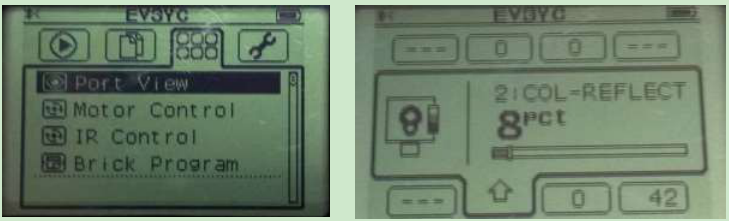

**Figure 5.1.** View sensor reading values from EV3 Brick screen

###Exercise 2. Finding sensor reading by a program

You can write an ASU VIPLE program to find the sensory value. Figure 5.2 shows the code for EV3 sensors. A similar program can be written for Edison robots. We will test the motors in the next exercise.

**Figure 5.2.** View sensor reading values using s program 

For EV3 or Edison robot, adding more sensors into the program and test them.  

###Exercise 3. Connecting robot to Computer via Bluetooth or Wi-Fi

To make the diagram in Figure 5.2 work with a physical robot, we need to configure the devices used in
the diagram in a number of steps.

**Step 1:** Configure the EV3 brick. Similar to the Microsoft VPL code, we use a main brick, called My EV3 Brick, to define the major configuration. It is possible to add more than one brick into a diagram. Right- click the brick to open the configuration. Figure 5.3 shows the right-click window and the two configuration windows. Change Connection Type window allows us to choose one of three available connection methods: Wi-Fi, Bluetooth, and USB. If Bluetooth is selected, the standard Bluetooth pairing process can be used to establish the connection between the computer running the ASU VIPLE program and the robot.

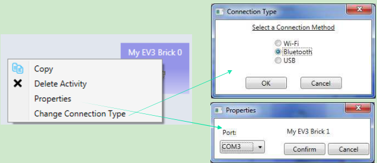

**Figure 5.3.** Configuration of the EV3 brick using Bluetooth connection

**Step 2:** Configure the other devices. For each device, we need to choose the partner and choose the connection ports that the devices use. There is one device used in this diagram: the Drive service. Figure
5.4shows the right-click window to the EV3 Drive service. The configuration sets the Drive service to partner with My EV3 Brick 0, and we assume that the Drive wheels are connected to the motor ports B and C on the EV3 Brick 0, respectively.

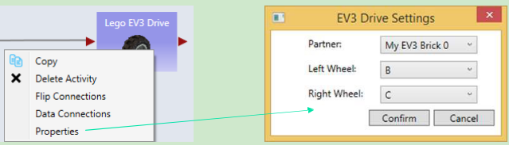

**Figure 5.4** Configuration of the EV3 brick

Step 3: Establish the connection. We assume that Bluetooth connection is selected. Bluetooth connection process depends on the Bluetooth device installed on your computer. A typical process consists of the following steps:

(1)Open the Bluetooth panel from the computer’s Task Bar, and choose Add a Device.

(2)The Bluetooth panel will show the devices that are ready to add. Find the EV3 robot that you want to add. Note, you can see the robot name on your EV3. You can also change name to make it unique.

(3)Once the add request is issued from the computer, the EV3 side will pop up a confirmation check box. Confirm it. EV3 will further generate a pass code 1234. Confirm the code again.

(4)On the computer side, a textbox will then pop up. Enter the pass code 1234 to connect.

(5)After the connection, we still need to know the “Outgoing” COM port of the connection. This port needs to be entered into the Property window in My EV3 Brick 0, as shown in Figure 6. To find the COM port, open the Bluetooth panel from the Task Bar and choose Open Bluetooth Settings.     We will see the COM Ports, as shown in Figure 5.5.

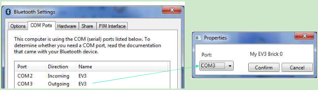

**Figure 5.5.** Find the COM port for My EV3 Brick 0 configuration

Once the configuration is completed, we can start to run the program and use the keyboard to drive the robot forward, backward, left, right, and stop.

We do not use Wi-Fi here. However, if Wi-Fi is selected for connection, as shown in Figure 5.6, we need to find the IP address of the robot and enter it into the Properties window so that the ASU VIPLE program can establish the Wi-Fi connection to the robot. Using the buttons and the screen on EV3, you can choose the Wi-Fi network to connect to and find the IP address after the connection.

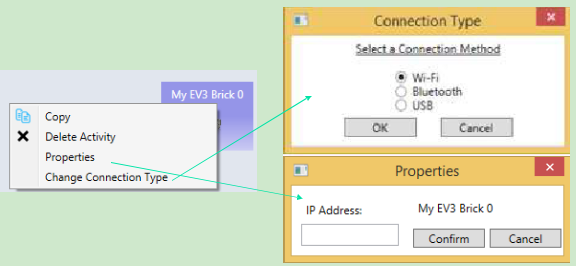

**Figure 5.6.** Configuration of the robot using Wi-Fi connection

##5.2Remote control of EV3 robots

###Exercise 1. Drive-EV3-by-wire in ASU VIPLE

Figure 5.7 shows the program that remotely controls an EV3 robot using the four arrow keys on the computer’s keyboard. The Key Press Events are services that offer the same functionality as that of the Direction Dialog in Microsoft VPL. As we can define the key individually and we can define more than four keys, using Key Press Events is more flexible than using Direction Dialog.

Quiz 1: How do you make the robot to turn left? How do you make the robot to turn right? 

Quiz 2: What could be a problem in driving the robot using this program?

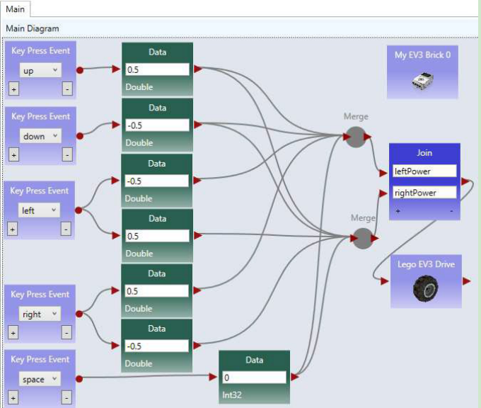

**Figure 5.7.** Drive an EV3 robot by wire

###Exercise 2. Improving the Driving Experience

It is hard to control the robot using the program in the previous exercise. The main problem is that the robot does not stop or slow down when the key is released. We can improve it by removing the drive power when the key is released, as shown in Figure 5.8.

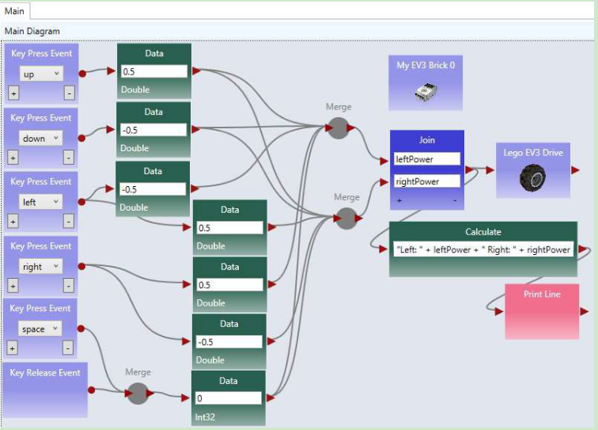

**Figure 5.8.** ASU VIPLE program drive-by-wire using key press events, with key release programmed Quiz: What does the Print Line service do in this program?

##5.3Line-following program in ASU VIPLE

###Exercise 1. Installing a color sensor

Before you can write the line-following program, you need to install a color sensor (or a light sensor) on your robot. The senor head must face to the floor, so that the robot can recognize the line and move following the line on the floor. The distance between the color sensor’s head and the floor must be between one or two coin’s thicknesses, so that the color sensor can better read the light reflection from the floor. Depending on the color of the floor (background) and the color of the line, you need to calibrate and find the good reflection values. You can use the buttons and screen on EV3 brick to do the sensor value calibration, as discussed in Section 5.1.

###Exercise 2. Line-follower

Figure 5.9 shows ASU VIPLE code that makes the EV3 follow a black line on the light-brown floor. The initial position of the color sensor is on the black line or on the right side of black line. The If-activity

checks the sensor reading. If the reflection value is less than 20 (reading from black line), and the robot is not in Adjusting state, the robot will turn right for 200 milliseconds and then move straight forward. This action will make the robot moving away from the black line, resulting the sensor reading value to be greater than 20. In this case, the robot will turn left and move towards the black line. When the sensor sees the black line, it starts to move away from the black line. The variable Adjusting is used to make sure that the robot completes the 200 milliseconds adjustment before it turns right.

The program does not have a loop. It is event-driven. The event source is the color sensor, which generates events periodically. Whenever an event happens, the If-activity will be triggered and executed.

**Figure 5.9.** The line follower program in ASU VIPLE

Figure 5.10 shows the color sensor properties and the three EV3 Drive power values that control the robot turning right, moving straightforward, and turning left.

**Figure 5.10.** Sensor properties and the Drive power settings

##5.4Sumo Robot Programming

Before you program your sumo-robot, install the color sensor in the front part of you robot and face to the floor. In order to read the black ring outside the sumo-ring, the color sensor must be so close to the floor, that you cannot insert more than two coins below the color sensor.

###Exercise 1: Basic Sumo-Robot Algorithm

The color Sensor measures the light intensity, which enables your robot to distinguish between light and dark and different colors. The code below shows that simple code that can detect the black ring of the white sumo board.

**Figure 5.11.** Basic program for sumo robot

The basic sumo robot algorithm using a single sensor (color sensor) can be described as follows.

**Sumo Algorithm 1: Basic Sumo with Light Sensor, with the Light Sensor Installed Faced to Floor**

6. The robot moves forward;
7. If the light sensor detect a color change (an event that the robot runs into the edge ring), the robot stops;
8. It moves backward for certain distance;
9. It turns a random number of degrees;
10. It returns (loops) to step 1.

To improve the performance of the sumo robot, you can use a touch sensor in addition to the color sensor. When the touch sensor is pressed, your sumo robot should move against that direction. You can also use an ultrasonic sensor to detect the opponent. The following algorithms give you the ideas how you can program a winning sumo-robot.

###Exercise 2: Adding a touch sensor to the sumo-robot

The algorithm in Exercise 1 is random and hopes to push the opponent out of the ring by chance. By adding more sensors into the robot, your sumo robot will have a better chance to win. The following algorithm assumes that a touch sensor is installed as the rear bumper of the robot to detect the attacks from the behind.

**Sumo Algorithm 2: Sumo Using Light Sensor and Touch Sensor**

1. The robot moves forward;

2. If the touch sensor is pressed, robot moves backwards, trying to counter push the opponent. You may consider to spin 180 degree to attack the opponent use your font effector!
3. If the touch sensor is released, robot stops and returns to step 1. As your robot does you have a light sensor at the rear end, backward moving may easily moves out of the ring.
4. If the light sensor detect a color change, the robot stops;
5. It moves backward certain distance;
6. It turns a random number of degrees;
7. It returns (loops) to step 1.

This algorithm will avoid the robot being pushed out of the ring from the behind.

###Exercise 3: Adding the ultrasonic sensor to the sumo-robot

Furthermore, an ultrasonic sensor can be added on the left (or right) side of the robot to detect the opponent and attack the opponent proactively.

**Sumo Algorithm 3: Sumo Using Light Sensor, Touch Sensor, and Ultrasonic Sensor**

1. The robot moves forward;
2. If the ultrasonic sensor reading distance < 200,   turn 90 degree left (or right if the sensor is installed on the right side), and then return to step 1, trying to attack the opponent.8.   If the touch sensor is pressed, robot moves backwards, trying to counter push the opponent. You may consider to spin 180 degree to attack the opponent use your font effector!
3. If the touch sensor is released, robot stops and returns to step 1. As your robot does you have a light sensor at the rear end, backward moving may easily moves out of the ring.
4. If the light sensor detect a color change, the robot stops;
5. It moves backward certain distance;
6. It turns a random number of degrees;
7. It returns (loops) to step 1.

##5.5Wall-following program in ASU VIPLE

Before you start write the program, you need to install two sensors on your robot. A distance sensor facing the right-side (for following the right-side wall) of the wall and a touch sensor in the front of the robot.

###Exercise 1. EV3 Robot Wall-following maze navigation in ASU VIPLE (main diagram)

First, we define the right-wall-following algorithm using the finite state machine in Figure 5.11.

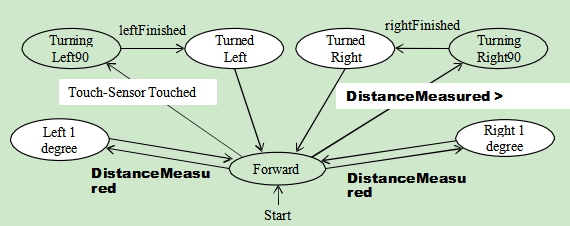

**Figure 5.11.** Finite state machine describing the right-wall-following algorithm

Two variables are used. An integer type variable BaseDistance stores the desired distance to the wall, which is initialized to 50 millimeter or the initial measurement of the range sensor. A string variable Status is used to store the moving status of the robot, and it is initialized to “Forward.” The Status variable can take one of these values: “Forward,” TurningLeft,” “TurnedLeft,” “TurningRight,” and “TurnedRight.” We do not need a status value for turning “Left 1 degree” or “Right 1 degree,” as these two actions can be done instantly, and other actions do not need to coordinate with these two status. The execution process can be described in the following algorithm.

4. Variable BaseDistance = 400 (or initially measured distance);
5. The robot repeats all the following steps in a loop, until the touch-sensor-pressed event occurs;
 * Status = “Forward”; Robot moves forward;

 * Robot keeps measures the right side-distance in certain interval defined by polling frequency, and it compares the newly measured distance with the distance stored in variable BaseDistance;

 * If the distance measured is less than BaseDistance - 5, the robot turns one degree left, and then returns to step 2;

 * If the distance measured is greater than BaseDistance + 5, turns one degree right, and then returns to step 2;

 * If the distance measured greater than BaseDistance + 200,  Status = “TurningRight90”; start to turn 90 degree right; after turning, Status = “TurnedRight”; and then returns to step 2;

6. Touch sensor is pressed; robot moves backward 0.5 rotations, Status = “TurningLeft90”; start to turn 90 degree left; after turning, Status = “TurnedLeft”; and then returns to step 2;

Following the finite state machine, we now can write the code for a robot to autonomously navigate through a maze. Figure 5.12 shows the main diagram that implements the finite state machine. A main brick, an ultrasonic sensor, a touch sensor, and a drive service are used in the program.

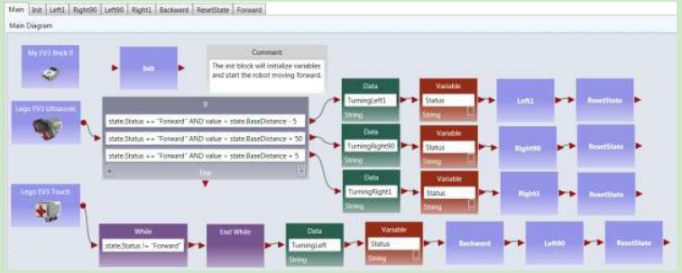

**Figure 5.12.** The main diagram of the right wall-following program

###Exercise 2. Write the Init Activity

**Figure 5.13.** The Init Activity

###Exercise 3. Write the Left1 Activity

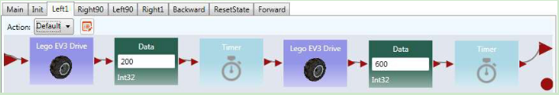

The data connection for the two driver services are as follows.

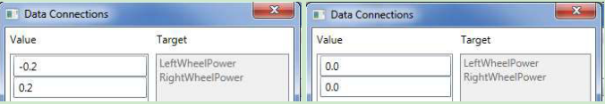

**Figure 5.14.** The Left1 Activity and Data Connection

###Exercise 4. Write the Right90 Activity

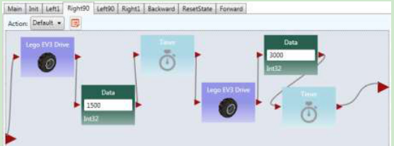

The data connection for the two driver services are as follows.

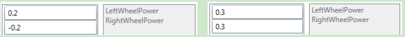

**Figure 5.15.** Right90 Activity and Data Connection

###Exercise 5. Write the Left90 Activity

Based on the code Right90 to implement the Left90

###Exercise 6. Write the Right1 Activity 

Based on the code Left1 to implement the Right1 

###Exercise 7. Write the Backward Activity
Use negative power for both wheels

**Figure 5.16.** Backwards Activity

###Exercise 8. Write the ResetState Activity

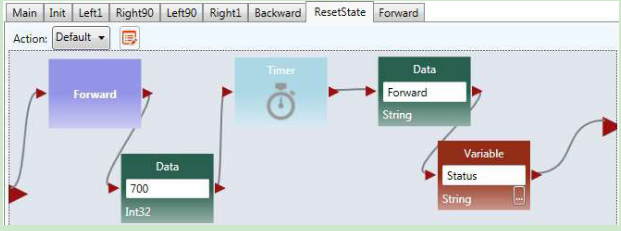

**Figure 5.17.** ResetState Activity

###Exercise 9. Write the Forward Activity

**Figure 5.18.** Forward Activity and Data Connection

###Exercise 10. Configure Sensors in Wall-following maze navigation in ASU VIPLE

Similar to Microsoft VPL, activities that define components can be defined in ASU VIPLE. In the previous exercises, the codes of the activities, Init, Backward, and Left1 are developed.

For each sensor, we need to choose the partner and choose the sensor port that the device uses. For the main brick and the drive service, the same configurations are used as used in Figure 6, Figure 7, and Figure 8. Figure 5.19 shows the right-click window to configure the EV3 Ultrasonic distance sensor and the Touch sensor, respectively. The configurations assume that all the devices will partner with My EV3

Brick 0, the Ultrasonic sensor is connected to senor port 3, and the Touch sensor is connected to senor port 4 on the EV3 Brick.

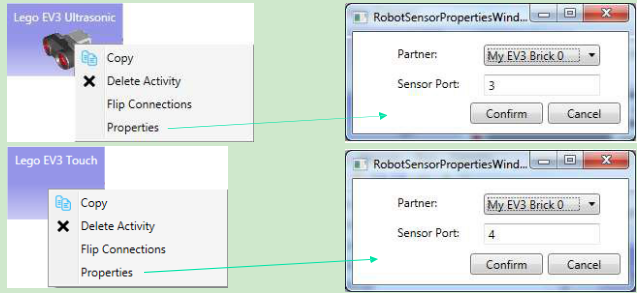

**Figure 5.19.** Configurations of the EV3 Ultrasonic sensor and Touch sensor

The full code of right wall-following program and the video of the robot’s navigating the maze, as well as other sample code, can be found in the ASU VIPLE site:  http://neptune.fulton.ad.asu.edu/VIPLE.

##5.6 Wall-following program using event-driven programming style

Thus far, our algorithms have been implemented mainly using sequential programming, except the predefined key press events and robot sensor events. Defining our own set of events provides several advantages, including clearer code and better support parallel processing. In addition, using events allows us to more closely represent the original finite state machine. Some of the transitions in the finite state machine are actually events, rather than user input. In this section, we will redesign the foregoing wall-following program using event-driven programming.

###Exercise 1. Redesign Left90 activity using event-driven programming style

We start with turning “Left90”. We are supposed to move to “Turned Left 90” and “Forward” after the “leftFinished” event triggers. Figure 5.20 demonstrates the changes required to define this event. Inside the “Left90” activity, we will draw a line to the circle output port instead of the triangle output port. The circle represents an event and declares that we want to trigger an event when we are done turning left
90. Since we are not drawing a line to the triangle, the activity block will never output a value to an activity connected sequentially after the “Left90” activity.

**Figure 5.20.** Adding an event trigger in the “Left90” activity

###Exercise 2. Redesign the other activities using event-driven programming style

Make similar changes in the “Left1,” “Right90,” “Right1,” and “Backward” activities.

###Exercise 3. The Main diagram based on the event-driven activities

Now that we have defined our events in the activities, we need to update the Main diagram to handle the events. An event handler is a piece of code which is executed whenever a certain event occurs. We can define a custom event handler for our events using the “Custom Event” activity. By selecting one of our activity blocks in the drop down menu, we can handle any events triggered by that activity block.

For example, if we select “Left90” in the “Custom Event” activity’s drop down box, the code following that “Custom Event” activity will execute immediately after the code shown in Figure 5.20 reaches the circle pin. Figure 5.21 shows the updated program which uses events to transition between states instead of sequential programming. We also used a “Merge” activity to avoid repeating the “ResetState” activity.

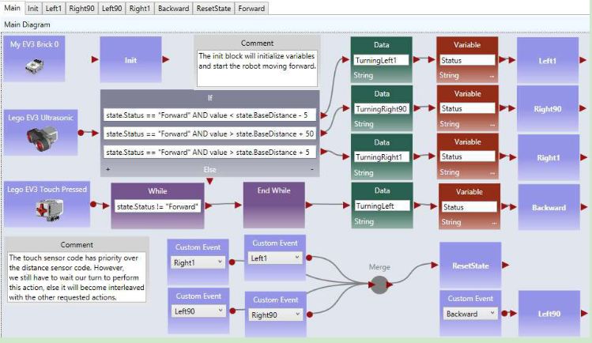

**Figure 5.21.** The right wall-following algorithm with custom events

##5.7 Maze navigation using local best heuristic algorithm

###Exercise 1. Implementing the Main diagram of the two distance algorithm

In this exercise, we use the maze navigation algorithm defined in the finite state machine defined in Figure 5.22. We will use ASU VIPLE to implement this heuristic algorithm. As ASU VIPLE is an event- driven language, it is the best way to specify the algorithm in a finite state machine. In the diagram, we use two variables. The variable “Status” can take six possible string-type values of Forward, TurningRight, TurnedRight, TurningLeft (Spin180), TurnedLeft, and Resume180. The int-type variable “RightDistance” is used to store the distance to the obstacle after the robot turned right.

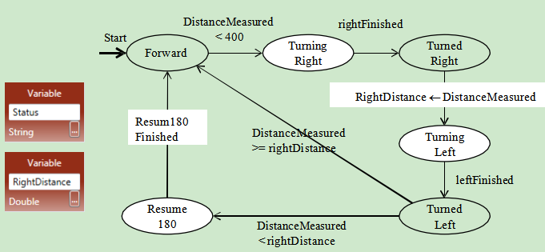

**Figure 5.22.** State Diagram of a maze navigation algorithm

The finite state diagram in Figure 5.22 implements a heuristic algorithm. Notice that the EV3 robot we built can rotate the head, and thus, we can rotate the sensor without rotating the body of the robot.

The algorithm is said to be heuristic, because it cannot find a solution in all cases of mazes. However, it has a good chance to find a solution in most mazes, given the information available collected by a single range sensor.
Figure 5.23 shows the code of the Main diagram.

**Figure 5.23.** Main diagram

###Exercise 2. Implementing SensorRight90

As the distance sensor head rotates, instead of the robot body rotating, the code for implementing the SensorRight90 is shown as follows.

###Exercise 3. Implementing the other activities

Follow the example in the exercise above and the activity codes in the Chapter 3 to implement the rest of the activities.