#  IoT and Robotics Problem Solving in Visual Programming 

##Laboratory Manual

[http://neptune.fulton.ad.asu.edu/VIPLE/](http://neptune.fulton.ad.asu.edu/VIPLE/).

Yinong Chen and Gennaro De Luca
School of Computing, Informatics, and Decision Systems Engineering Arizona State University

Microsoft VPL is a milestone in software engineering and robotics from many aspects. It is service- oriented; it is workflow-based; it is event-driven; it supports parallel computing; and it is a great educational tool that is simple to learn and yet powerful and expressive.

Sponsored by two Innovation Excellence awards from Microsoft Research in 2003 and in 2005, Dr. Yinong Chen participated in the earlier discussion of service-oriented robotics at Microsoft. Microsoft VPL was immediately adopted by Chen in developing the freshman course CSE101 in 2006. The course grew from 70 students in 2006 to over 350 students in 2011. The course was extended to all students in Ira A. Fulton Schools of Engineering at ASU and was renamed FSE100, which is offered to thousands of freshman engineering students now.

Unfortunately, Microsoft stopped developing and supporting VPL recently, which lead to our FSE100 course, and many other schools’ courses using VPL, without further support. Particularly, the current version of VPL does not support LEGO’s third generation of EV3 robot, while the second generation NXT is out of the market.

To keep our course running and also help the other schools, we take the challenge and responsibility to develop our own visual programming environment, ASU VIPLE, based on the IoT and Robot as a Service concept. The purpose of this project is to provide a free environment supporting the VPL development community in education and research. To serve this purpose, ASU VIPLE keeps the great features that VPL has and provides a similar user interface and functionality, so that the MSRDS and VPL development community can use ASU VIPLE with no learning curve. ASU VIPLE does not replace Microsoft VPL. Instead, it extends VPL in its capacity to connect to different physical robots, including EV3 and Intel- based open architecture robots.

Robot as a Service and the ASU VIPLE environment are designed and developed by Yinong Chen and Gennaro De Luca, with contributions from Calvin Cheng, Megan Plachecki, and Sami Mian. ASU VIPLE documents, software, and sample code can be downloaded from the ASU Web Service and Application repository. The direct link is http://neptune.fulton.ad.asu.edu/VIPLE/

#Chapter 1
#Introduction to ASU VIPLE

ASU VIPLE uses the same computing model as Microsoft VPL. The program is running on a Windows computer, a desktop, a laptop, or a tablet. The computer sends commands to control the  robot actuators (motors) and receives the sensory data and motor feedback from the robot. The data between the computer and the robot is encoded in a JSON object which is in plain text format. It supports Wi-Fi, Bluetooth and USB connections between the main computer and the robot. ASU VIPLE supports EV3 and any self-developed robots. We have developed different robots based on Intel architecture, the Linux operating system, and the Windows operating system.

Figure 1.1 compares the basic activities between ASU VIPLE and Microsoft VPL. VIPLE implemented most basic activities in VPL and implemented additional While, Break, and End While activities to facilitate loop building, which can reduce the circular paths in VPL diagrams.

 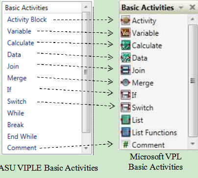

**Figure 1.1.** Activities and services: ASU VIPLE versus Microsoft VPL

As can be seen that VIPLE has similar programming constructs and ca be used for the same kinds of applications using these basic activities.

The usability of a language largely depends on the availability of library functions or called services. Figure 1.2 shows the ASU VIPLE services and Microsoft VPL services. Microsoft VPL  implemented multiple sets of vendor services, including general service, generic robot services, iRobot services, LEGO NXT services, and simulated services. The general services and generic robot services include Log, Text to Speech, SpeechRecognizer, Simple Dialog, Direction Dialog, Timer, etc. VPL many implemented multiple vendor services, such as LEGO NXT services, iRobot services, HiTechnic services, and simulated services.

 

**Figure 1.2.** ASU VIPLE services versus Microsoft VPL services

In the current VIPLE version, three sets of services are implemented only. The first set is a list of general services, including the Simple Dialog, Key Press Event (Direction Dialog), Text To Speech, Print Line (Log), Timer, and RESTful services. The second set of services is for EV3 robots, which correspond to the NXT services in Microsoft VPL. The third set of services are used to connect to generic robots, sensors, and motor services. The general services can be used not only for robots, but also for general purpose applications. The addition of LEGO EV3 services allows the VPL developers who used NXT robots to use the new LEGO EV3 robots. The generic robot services allow the developers to use VIPLE to connect to an open architecture robot. In Microsoft VPL, DSS services developed specifically for MSRDS can be added into the VPL service list. In ASU VIPLE, RESTful services can be accessed in VIPLE diagram. As RESTful services are widely used in today’s Web application development, the access to RESTful services extends the capacity of VIPLE to a wide range of resources. ASU VIPLE does not have simulated serviced at this time. A simulation environment is being implemented.

Many improvements are made in ASU VIPLE. For example, ASU VIPLE use state.varaible consistently. In VPL, local variables (the location of a variable’s use has a direct link to the variable) use variable name only, while and global variables use state.variable syntax. It is not easy for inexperienced programmer to recognize the scope of variables and often causes confusion.

#Chapter 2
#Essentials in ASU VIPLE

Download ASU VIPLE software, sample codes, and tutorial at:
 [http://example.com/](http://example.com/).

Unzip and open the folder Release, start the ASU VIPLE software from the file: VisualProgrammingEnvironment. Now, you can learn ASU VIPLE by following the tutorial exercises.

ASU VIPLE is general purpose programming language and is turning-complete in its capacity. It can be used for any kind of computation  tasks.  In ASU VIPLE, A  program is  represented  as a diagram of workflow, and the components are defined as activities in the diagram. We will learn the language through a series of examples and exercises.

##2.1  Basic Constructs in ASU VIPLE

There are 10 basic activities that can be used for constructing programs. These activities are briefly explained in Figure 2.1, and they will be exercised in the following programming exercises.

 

**Figure 2.1.**Basic Activities in ASU VIPLE

###Exercise 1. Hello World in ASU VIPLE
ASU VIPLE is similar to Microsoft VPL not only in concepts but also in programming. It is our intention to have Microsoft VPL programmers use ASU VIPLE with little learning. We now show examples of basic programming in ASU VIPLE. We start with the Hello World program. Figure 2.2 shows the two versions of code using VPL and ASU VIPLE. The two diagrams look the same. However, ASU VIPLE has simplified a couple of steps: it automatically changes the type to String after a string is entered, and the default null value step in Microsoft VPL is eliminated.

 

**Figure 2.2.** Hello world program in (a) Microsoft VPL and (b) ASU VIPLE

###Exercise 2. Input and Output in ASU VIPLE
Now, we use ASU VIPLE to implement the examples that we have implemented Microsoft VPL in the previous sections. Simple Dialog service in ASU VIPLE can be used for both input and output. The diagram in Figure 2.3 uses Simple Dialog for input first. The connection type is PromptText.  The following three dialog boxes in Figure 3 show examples of the data connection, input prompt when executing the code, and the output. The same diagram also uses Simple Dialog for output when the connection type is set to AlertDialog.

 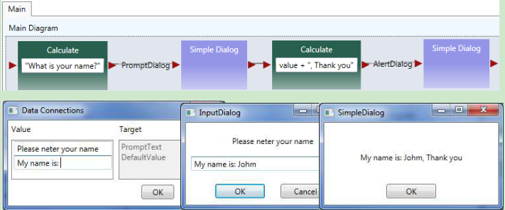

**Figure 2.3.** Using Simple Dialog to perform input and output

###Exercise 3. A Simple Counter in ASU VIPLE

Now, we can implement a simple counter in ASU VIPLE diagram, as shown in Figure 2.4. A similar implementation of the counter activity in Microsoft VPL can be found in our VPL tutorial.

 

**Figure 2.4.** A simple counter

###Exercise 4. Using While-Loop to implement Counter
We formed a loop by ourselves in the previous exercise. We can use a built-in loop in ASU VIPLE to make the program structure simpler. The diagram is shown in Figure 2.5.

  

**Figure 2.5.** Using while-loop for implementing the counter

Quiz: What is the main different between this counter and the counter in the previous exercise?

##2.2Activity and Parameter Passing in ASU VIPLE

Basic Activity and Activity are building blacks of diagrams or flowchart. Data transfer between the activities are through global variables and parameter passing.

###Exercise 1. Activity and Parameter Passing
In this exercise, we create a simple main and an activity. We illustrate the communication between the main and the activity through (2) global variables and (2) parameter passing.

In the program, String value Yinong Chen is assigned to OutVariable and the value is passing into the activity. The String value Hello is passed into the activity through the input put of the activity. The return value of the activity is assigned the output port and passed back to the Main diagram. Notice that the variables are global, and the Main diagram can also access the innerVariable to retrieve it value.

 

 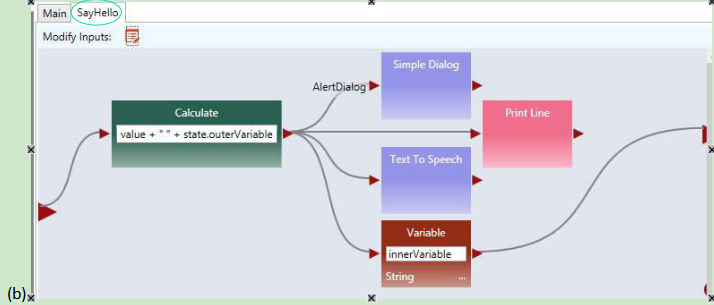

**Figure 2.6.** (a) Main diagram and (b) an activity

To use parameter passing, we need to define a parameter for the activity, and use “value” as the data connection to the activity, as shown in Figure 2.6 (c). The Main diagram and the activity code are given Figure 2.6(d).

 

**Figure 2.6.** (c) Define a parameter and (d) Main diagram and SayHello activity

###Exercise 2. Counter as an Activity in ASU VIPLE

As a more complex example, Figure 2.7 shows the ASU VIPLE program that implements: (a) a Main diagram and (b) a counter activity. The activity takes an input N in the main diagram. In the activity CountToN, it starts from 0 and adds 1 in each iteration. It stops when the counter value is equal to N. Text to Speech service is used to read out the numbers in the activity, and Simple Dialog Service is used to print the counted numbers. As can be seen in the activity diagram, both data output and notification (event) are supported in ASU VIPLE. A similar implementation of the counter activity in Microsoft VPL.

 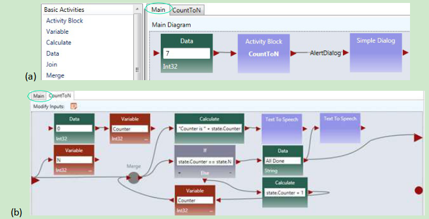

**Figure 2.7.** ASU VIPLE program example: (a) main program and (b) activity

Quiz: What is the main different between this counter and the counter in the previous two exercises?

##2.3Implementing finite state machine and event-driven programming

Although ASU VIPLE can be used as a general programming language, its strength is in event-driven programming that can response to a sequence of events. The event-driven applications are best described by finite state machines consisting of states and transitions between the states. The transitions are triggered by events. We will start to use ASU VIPLE for solving event-driven problems.

###Exercise 1. Implement a Vending Machine

Given a Finite State Machine (FSM) in Figure 2.8, we first implement the requirement of the vending machine without using event-driven programming.

 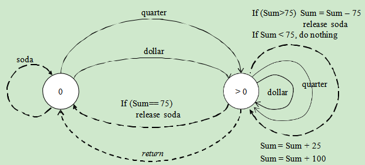

**Figure 2.8.** Finite State Machine of a vending machine

A sample VIPLE diagram is shown in Figure 2.9. We use Simple Dialog to take input

 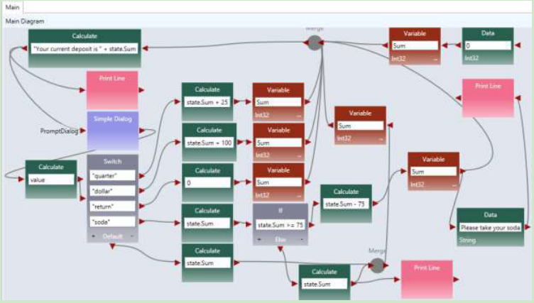

**Figure 2.9.**  ASU VIPLE program of the vending machine

###Exercise 2. Implement the Vending Machine Using Events

Change the program to use the Key Press Event as the inputs (triggers) of the finite state machine. Use

* q for quarter

* d for dollar

* r for return

* s for soda

 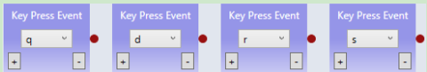

###Exercise 3. Garage Door Opener (part 1)

Given a Finite State Machine (FSM) in the following diagram, implement a simulated garage door control logic in ASU VIPLE.

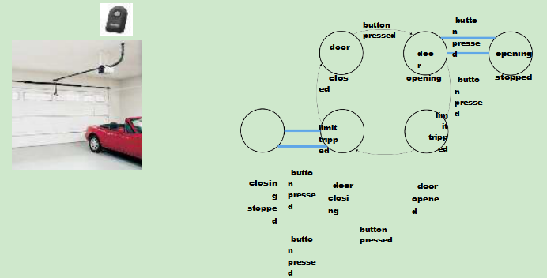

**Figure 2.10.**  Finite state machine of a garage door opener

The remote controller is a touch sensor or a key press event, and the limit sensor is a build-in sensor in the motor. When the door stop, the limit sensor will generate a notification. You can start your program similar to the maze navigation program we learned in Microsoft VPL, as shown in the diagram below.

**Figure 2.10.**  ASU VIPLE program (part 1) of the garage door opener

###Exercise 4. Garage Door Opener (part 2)
The limit sensor built-in the motor can be simulated as follows. When key m is pressed while the door is opening or is closing, the state will change and result will be displayed.

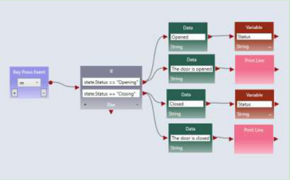

**Figure 2.11.**  ASU VIPLE program (part 2) of the garage door opener

At this time, ASU VIPLE does not have the simulated sensors and simulated drive (motors), we have to use key press event and Print Line to simulate the sensors and motors.

###Exercise 5. Parity Detection

Given a Finite State Machine (FSM) in the following diagram, implement a simulated parity detection logic in ASU VIPLE. The program must generate a 1 output if the number of 1s entered is an even number, otherwise, it must generate a 0 output. You can use the key press events to simulate the inputs 0s and 1s.

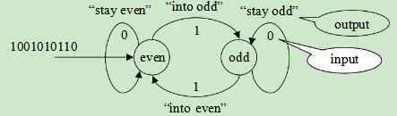

**Figure 2.12.**  Finite state machine for parity detection

One of the purposes of ASU VIPLE is to extend Microsoft VPL to more conveniently support EV3 and other physical robots. In the rest of the section, we will focus on using ASU VIPLE to connect to different physical robots. We start with the drive-by-wire program that controls the robot using the keyboard of the computer. Then, we will discuss the autonomous programs that control robots to navigate through the maze without any human intervention.

#Chapter 3
#Controlling Simulated Robots Using ASU VIPLE

In this section, we will write ASU VIPLE programs to control simulated robots.

##3.1VIPLE Robot Services
VIPLE is a programming environment with general-purpose functions, as well as IoT/Robotic specific functions. Three sets of services are implemented: General computing services, generic robotic services, and vendor-specific robotic services.

* General computing services: include input/output services (Simple Dialog, Print Line, Text To Speech, and Random), Event services (Key Press Event, Key Release Event, Custom Event, and Timer), and Web services (RESTful services and WSDL services), as shown in the first part of Figure 3.1. Most of the basic library functions supported in C# can be called in the data box of Calculate activity. Timer service takes an integer i as input, and it will hold data flow for i milliseconds. Timer service is frequently used in the robotic applications.
* Generic robotic services: VIPLE offers a set of standard communication interfaces, including Wi-Fi, TCP, Bluetooth, USB, localhost, and WebSocket interfaces. The data format between VIPLE and the IoT/Robotic devices is defined as a standard JSON (JavaScript Object Notation) object. Any robot that can be programmed to support one of the communication types and can process JSON object can communicate with VIPLE and be programmed in VIPLE. As shown in the second part of Figure 3.1, all VIPLE services that start with Robot are generic robotic services. We will use these services to program our Simulated robots and custom-built physical robots.
* Vendor-specific services: Some robots, such as LEGO robots and iRobots, do not offer an open communication and programming interfaces. In this case, we can offer built-in services in VIPLE to access these robots without requiring any programming efforts on the device side. Currently, the services for accessing LEGO EV3 robots are implemented, so that VIPLE can read all EV3 sensors and control EV3 drive-motors and arm-motor, as

shown in the third part in Figure 3.1. For those who do not want to build their own robots can simple use VIPLE and EV3 combination.

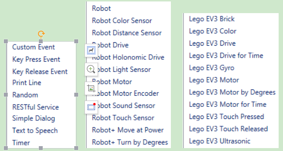

**Figure 3.1.** List of general services, generic robotic services, and EV3 services in VIPLE

In text, we will use generic robotic services to program simulated and physical robots. We will focus simulated robots in this chapter. We program the Intel-based physical robots and EV3 robots in the next two chapters. The robotics services are explained as follows.

* **Robot** service is used for defining the connection types, connection port, and connection addresses. Multiple Robot services can be used in one application to control multiple robots. For each motor service and sensor service used, a partner Robot need to be selected.
* Robot Motor and Drive services. A number of services are defined for controlling different types of motors defined on the devices. Which services to use are determined by the physical device that are programmed to connect to VIPLE, and they should be specified in device hardware manual.
 + **Robot Motor:** It controls a single motor. It requires to set up a partner Robot, a motor port number, and a drive power value between 0 and 1.0. The bigger the value, the faster the motor rotates. Positive and negative values are allowed, which will cause the motor to rotate in opposite directions.
 + **Robot Motor Encoder:** It is the same as Robot Motor, but it is of motor encoder type.
 + **Robot Drive:** Control two motors at the same time for driving purposes. It requires setting up a partner Robot, two motor port numbers, and two drive power values. The bigger the values, the faster the motors rotate. Positive and negative values are allowed. If two identified positive values are given, the robot moves forward. If two identified negative values are given, the robot moves backward. If one bigger value and one smaller value, or one positive value and one negative value are given, the robot turns left or right.
 + **Robot Holonomic Drive:** Control four motors at the same time for holonomic driving purposes, such as controlling a drone. It requires to set up a partner Robot, four motor port numbers, and three drive values for X component, Y component, and rotation.
 + **Robot+ Move at Power:** It requires to set up a partner Robot and a drive power value between 0 and 1.0 to move both wheels of robot forward (positive value) or backward (negative value). The motor port numbers are not required to specify (hard coded in the device). This service can be used in the simulated robot.
 + **Robot+ Turn by Degree:** It requires to set up a partner Robot and a degree value between 0 and 360. The motor port numbers are not required to specify (hard coded in the device). This service can be used in the simulated robot.

* **Robot sensors:** A number of sensor services are defined for reading data from the device, including color sensor, distance sensor, light sensor, sound sensor, and touch sensor. Each sensor requires to set up a partner Robot and a port number.

##3.2Implementing Maze Navigation Algorithms in Robotics Simulation

To program a robot to navigate through a maze, we need to choose or design an algorithm first. Different algorithms exist. They have different complexity and performance. The complexity of a computational algorithm is typically measured by the number of steps the algorithm needs to perform in the worst case. However, the maze navigation algorithms involve robot’s movements and turns. They involve mechanical operations, which are orders of magnitude slower than program execution steps. Thus, the main criteria for evaluating the maze navigation algorithms are the arc degree of robot’s turning and the distance of robot’s travelling.

We start with simple algorithms in a simple simulation environment (eRobotic), as shown in Figure 3.2: Right-wall-following algorithm and two-distance local best algorithm.

The eRobotics environment runs in the Web browser at the address:http://venus.eas.asu.edu/WSRepository/eRobotic/
[http://venus.eas.asu.edu/WSRepository/eRobotic/](http://venus.eas.asu.edu/WSRepository/eRobotic/).

In the given maze, it takes longer time for the right-wall-following algorithm to find the exit of maze.

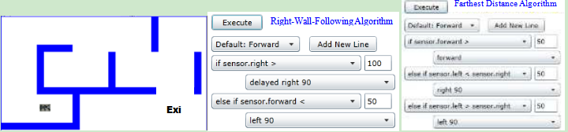

**Figure 3.2.** Simulated maze, right-wall-following and farthest distance algorithms

The right-wall-following algorithm can be described in the following steps:

1. Robot moves forward;
2. If sensor.right distance > 100, delay and then turn 90 degree to the right;
3. Else sensor.forward distance < 50, turn 90 degree to the left;
4. Return to step 1.

The simulated farthest distance algorithm can be described in the following steps:

1. Robot move forward;
2. If sensor.forward > 50, continue to move forward;
3. If sensor.left distance < sensor.right distance, then turn 90 degree to the right;
4. If sensor.left distance > sensor.right distance, then turn 90 degree to the left;
5. Return to step 1.

We can also easily implement a one-distance-first-working-solution algorithm as follows:

1. Robot move forward
2. If sensor.forward > 50, continue to move forward;
3. If sensor.right distance > 100, then turn 90 degree to the right;
4. If sensor.right distance < 50, then turn 90 degree to the left;
5. Return to step 1.

These algorithms are so simple that we do not need to use any states or variables. The reasons for the simplicity are as follows:

* The eRobot in Figure 3.2 has three distance sensors in front, left and right. It can make the decision based on three distances. If there is one distance in the front only, the robot will have to rotate to measure the distances on the other sides. Then, it will need to have a variable to save the previous distance.
* The eRobot in Figure 3.2 can move forwards and turns with 100% accuracy. If the motors are not accurate in moving straight or turning, the algorithm must consider the adjustment and compensation to correct the errors, which will requires states and variables.

In the reality, the motors are not accurate and not consistent. They cannot move in straight line and cannot turn the desired degrees. The drop-down list language in the eRobotics environment does not support states and variables, and it is not capable of simulating the physical robots that we will use in our experiments.

The Unity simulator is a more powerful simulation environment that can simulate more conditions. It works with VIPLE, which is a much more powerful programming language supporting variables, data, calculation, and various control structures. In this lab, we will use VIPLE and Unity simulator to implement various maze navigation algorithms that mimic more realistic situations.

##3.3Maze Navigation Algorithms Using Finite State Machine

Since our physical robot will have one distance sensor installed, we will define the algorithms in this section use one distance sensor only. The sensor is assumed to be installed in the front of the robot. We will use finite state machines to describe the maze navigation algorithms.

**First-Working-Solution Algorithm**

The first-working-solution algorithm is an algorithm that instructs a robot to move in the first direction that has a distance great than a given constant.  Figure 3.3 shows the finite state machine of this algorithm. The finite state machine consists of four states. The robot starts with “Forward”. If the front distance becomes less than a given value, the robot starts “Turning Left” 90 degrees. After “Turned Left”, the robot compares the distance sensor value. If it is big enough, the robot enter “Forward” state. Otherwise, it spins 180 degree back to the other direction and then moves forward.

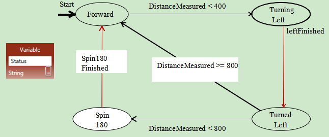

**Figure 3.3.** Finite state machine for the first-working-solution algorithm

**Two-Distance-Local-Best Algorithm**

The first-working-solution algorithm may not perform well in certain mazes. Figure 3.4 shows the two- distance-local-best (farthest distance) algorithm.

**Figure 3.4.** Finite state machine for the two-distance-local-best algorithm

Instead of comparing the left-side distance with a constant, it compares the left-side distance with right- side distance, and then moves to the side with farther distance. This finite state machine adds two states to include “Turning Right” and “Turned Right”. It also uses a variable to hold the RightDistance. Recall that the robot is assumed to have one distance sensor only. It has to store the right-side distance before it measures the left-side distance.

**Self-Adjusting Right-Wall-Following Algorithm**

Figure 3.5 shows the finite state machine for the self-adjusting right-wall-following algorithm. It assumes that there are two distance sensors, one in the front and one on the right side. The front sensor could be replaced by a touch sensor. The finite state machine uses two variables: Status and BaseDistance to the right wall. BaseDistance is initialized to a desired value to keep the robot in the middle of the road.

The robot starts with moving forward. It keeps the base distance with the right wall. If the distance to the right wall is too big (base distance+5), it turns one degree to right to move closer to the wall. If the distance to the right wall is too small (base distance -5), it turns one degree to left to move away from the wall.

If the right distance suddenly become very big (base distance+400), it implies that the right side is open and the robot should turn right 90 degree to follow the right wall.

If the front distance becomes too small (<200), it implies that no way in the front and no way on the right, thus, the robot has to turn left 90 degree.

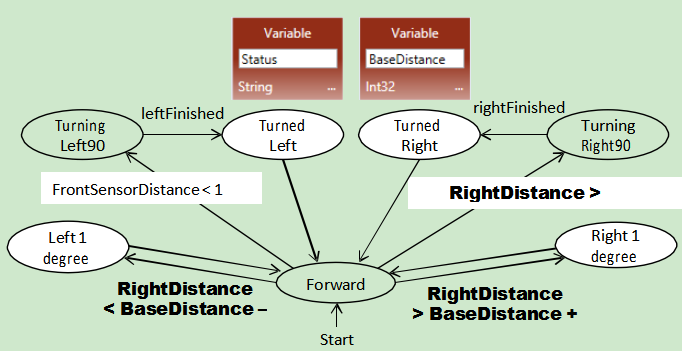

**Figure 3.5.** Finite state machine for the self-adjusted right-wall-following algorithm

The performance of maze these navigation algorithms depends on the maze too. If we apply these three algorithms in the mazes shown in Figure 3.6, which algorithm will perform the best?

**Figure 3.6.** Different mazes can impact the performance of navigation algorithms

##3.4Lab Assignments in Unity Simulator

Now, you are ready to take the online pre-lab quiz. You must complete the quiz before you attend the lab. In this chapter, you will start with implementing autonomous maze navigation algorithms using the Unity Simulator.

Before you start programming, please download a new version of VIPLE from:
http://neptune.fulton.ad.asu.edu/VIPLE/
[http://neptune.fulton.ad.asu.edu/VIPLE/](http://neptune.fulton.ad.asu.edu/VIPLE/).

###Exercise 1. Drive-by-wire simulation

We have been using VIPLE for general programming in flow control style and in event-driven style. These preparations are necessary for fulfilling our main purpose of programming IoT and robotics applications.

In the rest of the section, we will focus on robotics application development using both simulated and physical robots. We start with the drive-by-wire program that controls the robot using the keyboard of the computer. Then, we will discuss the autonomous programs that control robots to navigate through the maze without any human intervention.

A number of robot services are implemented in VIPLE to facilitate different robots

**Step 1:** First, drag and drop the service “Robot” in the diagram. Right click the robot to use the following configurations (1) In Set TCP Port: set port number to 1350, In Properties: choose localhost, and in Connection Type: choose Wi-Fi, as shown in Figure 3.7.

**Figure 3.7.** Configuration of the Robot service for simulation

**Step 2:** Now, we can write the drive-by-wire code as shown in Figure 3.8. You can follow the comments to sect the data connection values. You can find the services in the VIPLE service list.

**Figure 3.8.** Basic drive-by-wire diagram

You must right click each Robot Move or Robot Turn activity and choose “My Robot 0” as the partner.

When you start the code, you will not see anything happening. We need a simulator or a real robot to see the robot controlled by the code. We will a simulator at this time and use a real robot later.

**Step 3:** Start the Unity simulator in VIPLE by choosing the VIPLE menu Run -> Start simulator. Figure 3.9 shows the VIPLE start command and the simulated maze environment and the robot. Now, you can drive your robot using the five keys: w, d, a, s, and space. You can also change the maze by mouse- clicking the maze area to add and remove bricks.

**Figure 3.9.** The simulation environment

When you are done, please notify your lab instructor and demonstrate your program for sign-off. Then change the driver to proceed to the next assignment.

###Exercise 2. Understanding the VIPLE Diagram

Read the VIPLE diagram given in Figure 3.10 and answer the following questions.

**Figure 3.10.** Main diagram of a maze navigation algorithm

1. What algorithm does this VIPLE diagram implement?
2. What states does this diagram use?

Hint, there two types of variables: (1) variables with a fixed (finite) number of possible values and (2) variables with unlimited number of values, such as integer or double. The finite state machine uses those variable’s values as states that have fixed (finite) numbers of possible values.
3. Draw the finite state machine of this diagram.

Hint: After you have decided the states in the previous question, now you can add transitions and the input and output related to each transition to form the finite state machine.
4. What values should be given to the Robot Move and Robot Turn services in order to complete the algorithm?

When you are done, please notify your lab instructor and demonstrate your program for sign-off. Then change the driver to proceed to the next assignment.

###Exercise 3: Implement the VIPLE Diagram in Unity Simulator

*Draw Diagram in VIPLE. Make sure you configure the Robot, sensor, and motor services with the following values.*

Right click the robot to use the following configurations: (1) In Set TCP Port: set port number to 1350; In Properties: choose localhost; and in Connection Type: choose Wi-Fi.

Right click each Move service and choose “My Robot 0” as the partner. If you use the Robot+ Move at Power and Robot+ Turn by Degree services, you do not need to set the port numbers.

Right click each Distance Sensor service, choose “My Robot 0” as the partner. Set Port to 1 for right sensor and set to 2 for the front sensor.

*Start the Simulator and run the diagram. Adjust the values given to the Robot Move and Robot Turn services to make the program work.*

Draw Diagram in VIPLE. Make sure you configure the Robot, sensor, and motor services with the following values.

Right click the robot to use the following configurations: (1) In Set TCP Port: set port number to 1350; In Properties: choose localhost; and in Connection Type: choose Wi-Fi.

Right click each Move service and choose “My Robot 0” as the partner. If you use the Robot+ Move at Power and Robot+ Turn by Degree services, you do not need to set the port numbers.

Right click each Distance Sensor service, choose “My Robot 0” as the partner. Set Port to 1 for right sensor and set to 2 for the front sensor.

Start the Simulator and run the diagram. Adjust the values given to the Robot Move and Robot Turn services to make the program work.

Follow Figure 3.6 to change the maze and test the effectiveness of the algorithm.

When you are done, please notify your lab instructor and demonstrate your program for sign-off. Then change the driver to proceed to the next assignment.

###*Exercise 4: The Activities of the Two-Distance-Local-Best Algorithm*

In this section, you will implement the two-distance-local-best algorithm. Its finite state machine is shown in Figure 3.4.

You will use modularized code to implement the algorithm. First, you create the activities needed, as shown in Figure 3.11

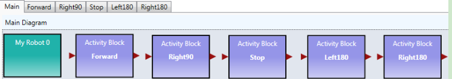

**Figure 3.11. Activities needed in the Main diagram**

The code for the activities are given in Figure 3.12. The code for turning Left180 and for Right180 is the same, except the turning degree is set to -180.0 and 180.0, respectively. The timer is used for delay the next operation for stability.

**Figure 3.12.** The code of the activities

Right click the Robot service to use the following configurations: (1) In Set TCP Port: set port number to 1350; In Properties: choose localhost; and in Connection Type: choose Wi-Fi.

Right click each Move and Sensor service and choose “My Robot 0” as the partner.

When you are done, please notify your lab instructor and demonstrate your program for sign-off. Then change the driver to proceed to the next assignment.

###*Exercise 5: The Main Diagram of the Two-Distance-Local-Best Algorithm*

Following the finite state machine, the first part of the Main diagram is given in Figure 3.13.

**Figure 3.13.** The first part of the Main diagram

The second part that is connected to the first part is given in Figure 3.14.

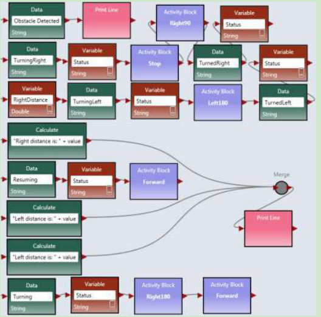

**Figure 3.14.** The second part of the Main diagram

*Start the Simulator and run the diagram.*

Follow Figure 3.6 to change the maze and test the effectiveness of the algorithm. Is this algorithm more efficient than the wall-following algorithm?

When you are done, please notify your lab instructor and demonstrate your program for sign-off.

##3.5 Lab Assignments in Web Simulator

In this lab assignment, you will start with implementing autonomous maze navigation algorithms using the Web Simulator.

###*Exercise 1: Web Simulator*

The Web Simulator implemented in VIPLE uses a different set of drive services. These services are the same as the services to be used in the physical robot, and thus, the programs written in the Web Simulator can be easily applied to the physical robot. The changes need to be made is the parameter values controlling the turning times.

The Web simulator can be downloaded from VIPLE site or directly started from: http://neptune.fulton.ad.asu.edu/VIPLE/WebSimulator/
You can also start the Web Simulator from VIPLE, as shown in the left part and the maze opened in the browser is shown on the right side of Figure 12.

The simulator is equipped with two ultrasonic distance sensors and one touch sensor, and you can use choose to have the sensor in the front, left, right or back of the robot, as shown in Figure 13. The port numbers of the sensor is defined in your VIPLE code. You can choose any number as the port number. If you use one sensor only, you must set the port number of the second senor to none. Click Add/Update Sensors after you have defined your sensors.

Note, due a security block in IE browser, the Web Simulator may not be able to communicate with VIPLE. Use Chrome or Firefox if they are available on your computer or phone.

**Figure 12.** Maze of the Web Simulator

Please read the instruction on the simulator page on the configuration requirements to connect VIPLE program.

**Figure 13.** Sensor setting of the Web simulator

When you are done, please notify your lab instructor and demonstrate your program for sign-off. Then change the driver to proceed to the next assignment.

###*Exercise 2: Configuring VIPLE to Use Web Simulator*

Now, you can go back to VIPLE. You can use the same drive-by-wire code that you used with Unity Simulator. However the configuration will be different.

**Step 1:** Right click My Robot to use the following configurations (1) In Change Connection Type: choose WebSocket Server. (2) In Change TCP Port: set port number to 8124, as shown in Figure 14.

**Figure 14.**  Configuration of the Robot service for simulation

**Step 2:** Use the drive-by-wire code that you used with Unity Simulator. After you start “Run: the VIPLE code, you need to go back to the Web browser and click “Connect to ASU VIPLE (WebSockets), as shown in the left part of Figure 15. This operation will connect your Web Simulator to VIPLE.

**Step 3:** Go back to your VIPLE code, click the console window (Run window), as shown in the right part of Figure 15. Only if the Run window is in the front, can the Key Press take effect. Now, you can use the keys to control the robot to move. The keys are programmed in your VIPLE code using Key Press events.

**Figure 15.** Connect the Web Simulator with VIPLE program and Run window

When you are done, please notify your lab instructor and demonstrate your program for sign-off. Then change the driver to proceed to the next assignment.

###*Exercise 3: Implement Wall-Following Algorithm in Web Simulator: Main Diagram*

We first implement the right-wall-following algorithm. The Main diagram is given in Figure 16. For My Robot 0, the connection type must be WebSocket Server and the TCP Port is 8124, as shown in Figure 14. Two sensors are used in the program. A distance sensor is used on the right hand side to measure the distance to the wall. A touch sensor used used in the front to detect the wall. The sensors must configured as follows:

* Right click Robot Distance Sensor and set Partner to My Robot 0 and Port number to 1.
* Right click Robot Touch Sensor and set Partner to My Robot 0 and Port number to 2.

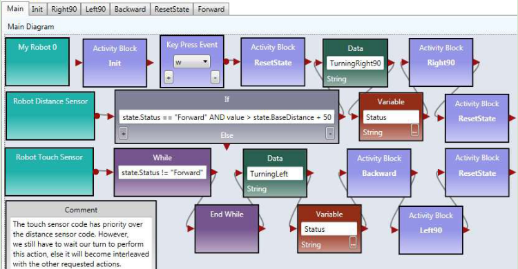

**Figure 16.** Main diagram implementing the right-wall-following algorithm

When you are done, please notify your lab instructor and demonstrate your program for sign-off. Then change the driver to proceed to the next assignment.

###*Exercise 4: Implement Wall-Following Algorithm in Web Simulator: Activities*

Now, we need to implement the Activity diagrams to be called in the Main diagram.

**Step 1:** Figure 19 shows the code for Init activity, which initializes the two variables and set the robot moves forward. There is no output from this activity.

**Figure 17.** The Init Activity

**Step 2:** Figure 18 shows the implementation of the Right90 activity. Right click the motor and select the data connection. The data connection values for the two drive services are shown in lower part of the figure. The first set of values cause the robot to turn right and the second set of values cause the robot to stop.

**Figure 18.** Right90 Activity and Data Connection

**Step 3:** You can follow the code for Right90 to implement Left90 by reversing the power on the wheels.

**Step 4:** Figure 19 shows the implementation of the Backward and Forward activities. For the Backward activity, the drive power can be set to -0.3 for both wheels. For the Forward activity, the drive power can be set to 0.5 for both wheels.

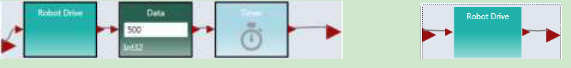

**Figure 19.** Backward and Forward Activities

**Step 5:** Figure 20 shows the code of for ResetState.

**Figure 20.** ResetState Activity

**Step 6:** Now you can the wall-following algorithm in Web Simulator. Use the following steps to test the program.

*Step 1: Start the Web Simulator*

*Step 2: Start to run VIPLE program.*

*Step 3: Step: Set up the sensor values in the Web Simulation.* 

*Step 4: Click “Add/Update Sensors”*

*Step 5:Click Connect to ASU VIPLE (WebScokets).*

If you use a Key Press event to star the move, you need to click the VIPLE’s Run window and use the key to star the move.

When you are done, please notify your lab instructor and demonstrate your program for sign-off. Then change the driver to proceed to the next assignment.

###*Exercise 5: Implement Two-Distance-Local-Best Algorithm in Web Simulator: Main*

*The Two-Distance-Local-Best Algorithm uses one distance sensor in the front of the robot, and thus, it need to turn the body of the robot to measure the distance on the right and then on the left.*

The main diagram will be similar to the code for  the Unity Simulator.  The differences are in  the parameter values. Figure 21 shows the first part and Figure 22 shows the second part of the Main diagram.

**Figure 21.** The first part of the Main diagram

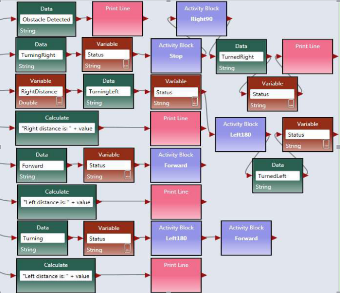

**Figure 22.** The second part of the Main diagram

When you are done, please notify your lab instructor and demonstrate your program for sign-off. Then change the driver to proceed to the next assignment.

###*Exercise 6: Implement Two-Distance-Local-Best Algorithm in Web Simulator: Activities*

You can write the code of the activities in the same way as the code for the wall-following program. For the Init activity, you do not have the baseDistance variable to initialize. For the Left180 activity, you can start from Left90, and use longer time to make 180 degree.

Right Click the Robot Distance Sensor to set the Port to 3, and configure the Web Simulator in the Web browser accordingly. Since this program uses one sensor only. Set the second sensor to none.

Follow the same process to test the code, as you did in testing the wall-following algorithm. When you are done, please notify your lab instructor and demonstrate your program for sign-off.

#Chapter 4
#Programming Intel Robots Using ASU VIPLE

In this section, we will write ASU VIPLE programs to control self-built open architecture robots. We have built a robot using Intel Edison board with Linux operating system.

##4.1Constructing and configuring your robot

###Exercise 1. Build Your Robot

This exercise depends on what have been preinstalled. The followings show the steps needed if nothing is preinstalled.

To assemble an Intel Edison robot, you can start with the instructions to install software on an Edison processor with an Arduino breakout board: [https://software.intel.com/en-us/assembling-intel-edison-board-with-arduino-expansion-board](https://software.intel.com/en-us/assembling-intel-edison-board-with-arduino-expansion-board).

For constructing the robot part, you can follow the instructions given by your instructor. The following links shows two of the Edison robots built at ASU

* Sample robot in ASU VIPLE site:  [ http://neptune.fulton.ad.asu.edu/VIPLE/]( http://neptune.fulton.ad.asu.edu/VIPLE/).

The software installed on the Edison robot is listed as follows:

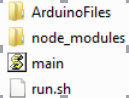

where, the file run.sh is the script to start the program on the robot. We need to start this file before ASU VIPLE can communicate the robot. The file main.js is a JavaScript program that performs most of the work on the robot. It establishes the connection with the Wi-Fi router, displays the IP address on the screen, and waits for the host computer to connect. Notice that the Edison robot and the host computer must connect to the same router. The main.js program also interprets the JSON packets from the host computer and sends the commands to the motors. The folder node_modules contains the library functions that support the scripts in main.js. The folder ArduinoFiles contains the code that read the sonic sensor to obtain the distance value measured by the sensor.

ASU VIPLE supports an open  interface to other robot platforms.  Any robot that  follows the same interface and can interpret the commands from ASU VIPLE program can work with ASU VIPLE. ASU VIPLE program communicates with the robot using the following JSON object, which defines the input to the robot from the ASU VIPLE program and the output from the robot to the ASU VIPLE program.

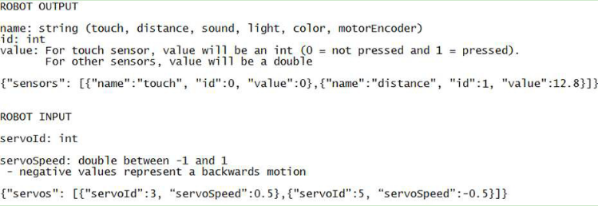

The ASU VIPLE environment will encode the control information into this object. The robot needs to interpret the script and perform the actions defined. On the other hand, the robot will encode the feedback in the same JSON format, send that back to the ASU VIPLE program, and the ASU VIPLE program will extract and use the information to generate the next actions.

Sponsored by the Intel IOT Group, a number of robots based on Intel architecture, including Intel’s Galileo, Bay-Trail, and Edison, have been developed. ASU VIPLE can connect to these robots via Wi-Fi or Bluetooth, send commands to them, and control them to perform different tasks.

ASU VIPLE implemented two types of robots: EV3 robots and generic robots. A generic robot is a robot that can communicate with the computer running ASU VIPLE and can process the JSON packet.

###Exercise 2. Starting the Program on Edison Robot

This exercise assumes that no starting script is given and manual steps are required. Then, the followings are the steps need to be done before your ASU VIPLE program can control the Edison robot.

1. Installed Edison driver program on the computer that will communicate with the Edison board.
2. Turn on the Edison board power and motor power.
3. Wait for the robot to connect to the default router and to display the IP address.
4. Start SSH from the host computer to log into the Edison using the displayed IP address.
5. Enter the Edison’s user name, e.g., root
6. Enter the Edison’s Password, e.g., password
7. Use SSH shell command to start the program by executing ./run.sh

If the IP address does not appear on the screen of the robot, you can perform the following steps to find the IP address of the robot.

1. Connect robot to the host computer using a USB cable;
2. Start SSH from the computer to log onto the Edison using this IP Address: 192.168.2.15
This can only be done from a computer that has been set up according to these instructions: [https://software.intel.com/en-us/connecting-to-intel-edison-board-using-ethernet-over-usb](https://software.intel.com/en-us/connecting-to-intel-edison-board-using-ethernet-over-usb).
4. Password, e.g.: password
5. Find your IP Address using ifconfig command OR force it to display on the screen by running this command: python ip.py
6. If you need to connect to a new network, you can configure the WiFi on the Edison using this command: configure_edison --wifi
Full  instructions  for  doing  so  are  here: [https://software.intel.com/en-us/connecting-your-inteledison-board-using-wifi](https://software.intel.com/en-us/connecting-your-inteledison-board-using-wifi).

Additional note:

 Each time you want to connect to the Edison from ASU VIPLE you need to re-run the script (./run.sh). Each script run only accepts one connection, after which it won't be able to accept another connection.

###Exercise 3. Pairing Edison Robot with the host computer

To connect a robot to ASU VIPLE program, the computer running the ASU VIPLE program needs to pair with the robot.

As long as a robot can (1) establish a Wi-Fi or Ethernet connection with the computer running the ASU VIPLE program, (2) encode the information into the JSON object, and (3) interpret the command from the ASU VIPLE program, the robot can be run from the ASU VIPLE program.

Now, we can start the exercises with ASU VIPLE and Edison robot.

##4.2Sensor testing and remote controlling

###Exercises 1. Sensor testing and configuration

Before we program the sensors into our application, we test all physical sensors and make sure they work as expected. Figure 4.1 shows the connections of sensor to the output services. We will test the motors in the next exercise.

**Figure 4.1.** Testing sensors

In order for the main robot, the sensors, and the motors to communicate with the ASU VIPLE properly, we need to configure the partnership between the main robot and its devices, the IP address, and ports. Figure 4.2 shows the configuration of the three devices: main robot, drive (motors) and the distance sensor. Notice that the numbers may differ from different robot configuration. Consulate your instructor for the numbers.

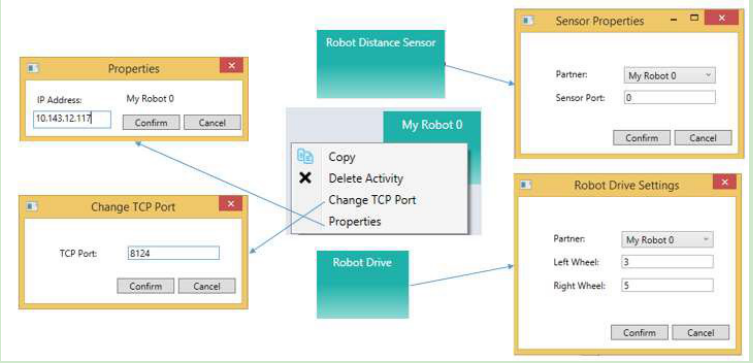

**Figure 4.2.** Configuration of My Robot and Robot Drive service

###Exercise 2. Drive-Edison Robot-by-wire in ASU VIPLE

Figure 3-3 shows the program that remotely controls an Edison robot using the four arrow keys on the computer’s keyboard. The Key Press Events are services that offer the same functionality as that of the Direction Dialog in Microsoft VPL. As we can define the key individually and we can define more than four keys, using Key Press Events is more flexible than using Direction Dialog.

Quiz 1: How do you make the robot to turn left? How do you make the robot to turn right? 
Quiz 2: What could be a problem in driving the robot using this program?

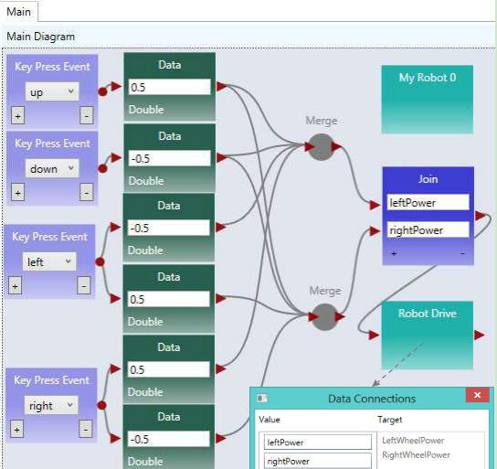

**Figure 4.3.** Drive an Edison robot by wire

###Exercise 3. Improving the driving experience

It is hard to control the robot using the program in the previous exercise. The main problem is that the robot does not stop or slow down when the key is released. We can improve it by removing the drive power when the key is released, as shown in Figure 4.4.

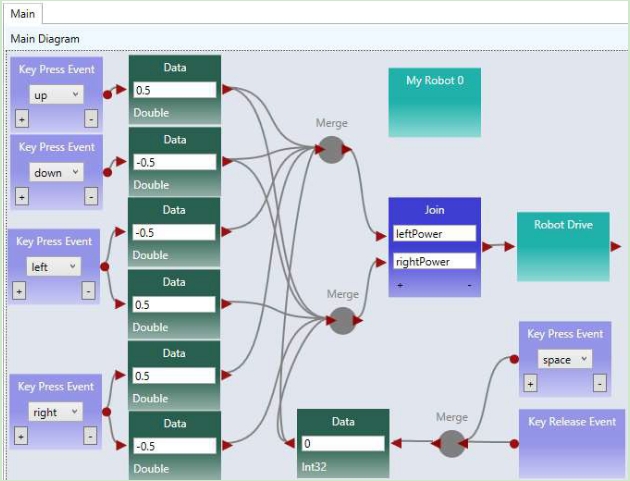

**Figure 4.4.** Improved driving experience

Quiz: What change is made and why do we make this change?

## 4.3 Maze navigation using wall-following algorithm

###Exercise 1. Robot Wall-following maze navigation (main diagram part 1)

Now, we will start to write more complex program so that the robot can move autonomously and react to the obstacles in a maze. We use the right-wall-following algorithm and define the algorithm using the finite state machine in Figure 4.5.

**Figure 4.5.** Finite state machine describing the right-wall-following algorithm

Two variables are used. An integer type variable BaseDistance stores the desired distance to the wall, which is initialized to 50 millimeter or the initial measurement of the range sensor. A string variable Status is used to store the moving status of the robot, and it is initialized to “Forward.” The Status variable can take one of these values: “Forward,” TurningLeft,” “TurnedLeft,” “TurningRight,” and “TurnedRight.” We do not need a status value for turning “Left 1 degree” or “Right 1 degree,” as these two actions can be done instantly, and other actions do not need to coordinate with these two status. The execution process can be described in the following algorithm.

* Variable BaseDistance = 400 (or initially measured distance);
* The robot repeats all the following steps in a loop, until the touch-sensor-pressed event occurs;

 + Status = “Forward”; Robot moves forward;

 + Robot keeps measures the right side-distance in certain interval defined by polling frequency, and it compares the newly measured distance with the distance stored in variable BaseDistance;

 + If the distance measured is less than BaseDistance - 5, the robot turns one degree left, and then returns to step 2;

 + If the distance measured is greater than BaseDistance + 5, turns one degree right, and then returns to step 2;

 + If the distance measured greater than BaseDistance + 200,  Status = “TurningRight90”; start to turn 90 degree right; after turning, Status = “TurnedRight”; and then returns to step 2;

* Touch sensor is pressed; robot moves backward 0.5 rotations, Status = “TurningLeft90”; start to turn 90 degree left; after turning, Status = “TurnedLeft”; and then returns to step 2;

Following the finite state machine, we now can write the code for a robot to autonomously navigate through a maze. Figure 4.6 shows the first part of the main diagram that implements the finite state machine.

**Figure 4.6.** The main diagram (part 1) of the right wall-following program

This part of the diagram implements these states in the finite state machine: Forward, Left1 degree, Right1 degree, Turning right, Turned Right90. A main brick, an ultrasonic sensor (distance sensor), and a drive service are used in this part of the program.

###Exercise 2. Robot Wall-following maze navigation (main diagram part 2)

Figure 4.7 shows the second part of the main diagram that implements the state Turning Left90 and TurnedLeft states after the touch sensor hits the front wall. In this implementation, we use another distance sensor. When the measured distance is less than 30, the robot considers that the there is no room to move forward further, and thus, it turns left 90 degree. If a touch sensor is used, the test condition will be “value == 1”, instead of “value < 30”. If a touch sensor is used, the robot will need to revise a bit, to make room for left turning.

**Figure 4.7.** The main diagram (part 2) of the right wall-following program

This two parts of the diagrams complete the main program. In the following exercises, we will complete the activities that implement the components.

###Exercise 3. Write the Init Activity

As shown in Figure 4.8, the Init activity will initialize the two variables and set the robot moves forward. There is no output from this activity.

**Figure 4.8.** The Init Activity

###Exercise 4. Left1 and Right1 Activities

Figure 4.9 shows the implementation of the Left1 activity. Right click the motor and select the data connection. The data connection values for the two drive services are shown in lower part of the figure. The first set of values cause the robot to turn left and the second set of values cause the robot to stop.

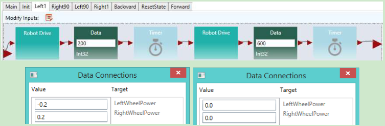

**Figure 4.9.** The Left1 Activity and Data Connection 

You can follow the code of Left1 to implement Right1.

###Exercise 5. Right90 and Left90 Activities

Figure 4.10 shows the implementation of the Right90 activity. Right click the motor and select the data connection. The data connection values for the two drive services are shown in lower part of the figure. The first set of values cause the robot to turn right and the second set of values cause the robot to stop.

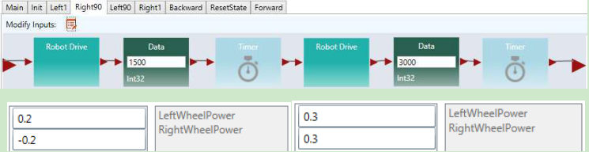

**Figure 4.10.** Right90 Activity and Data Connection 

You can follow the code of Right90 to implement Left90.

###Exercise 6. Backward and Forward Activities

Figure 4.11 shows the implementation of the Backward and Forward activities. For the Backward activity, the drive power can be set to -0.3 for both wheels. For the Forward activity, the drive power can be set to 0.3 for both wheels.

**Figure 4.11.** Backward and Forward Activities

##Exercise 7. ResetState Activity

Figure 4.12 shows the code of the ResetState.

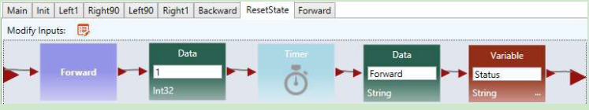

**Figure 4.12.** ResetState Activity

In the next set of exercises, we will use a different algorithm, the two-distance algorithm, to implement the maze navigation.

##4.4Maze navigation using local best heuristic algorithm

###Exercise 1. Solving the Maze Using the Two-Distance Algorithm

In this section, we will use ASU VIPLE to implement the heuristic (local best) algorithm using an Edison- based robot. As ASU VIPLE is an event-driven language, it is the best way to specify the algorithm in a finite state machine, as shown in Figure 4.13. In the diagram, we use two variables. The variable “Status” can take  six possible string-type values:  Forward, TurningRight, TurnedRight, TurningLeft (Spin180), TurnedLeft, and Resume180. The int-type variable “RightDistance” is used to store the distance to the obstacle after the robot turned right.

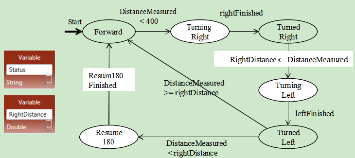

**Figure 4.13.** State Diagram of a maze navigation algorithm

The finite state machines implements a heuristic algorithm that can be elaborated in the following steps.

1. The robot starts to move forward;
2. If the distance measured by the range sensor is less than 400 millimeter, it turns (90 degree) right;
3. After  the  event  “rightFinished”  occurs,  it  saves  the  distance  measured  to  the  variable RigthDistance;
4. The robot then spins 180 degree left to measure the distance on the other side;
5. After the event “leftFinished” occurs, it compares the distance measured to the values saved in the variable RigthDistance;
6. If the current distance is longer, it transits to the state “Forward” to move forward;
7. Otherwise, it resumes (spins 180 degree) to the other direction;
8. Then, it transits to the state “Forward” to move forward.

The algorithm is said to be heuristic, because it cannot find a solution in all cases of mazes. However, it has a good chance to find a solution in most mazes, given the information available collected by a single range sensor. For the given maze in Figure 9.36; for example, the algorithm will navigate the finish line without a problem.

Figure 4.14 shows the first part of the main diagram of ASU VIPLE code.

**Figure 4.14.** The first part of the main diagram implementing the two-distance maze algorithm

The algorithm starts with the robot moving forward. When it approaches a wall in the front, it measures the distance to the right and saves the distance into a variable. Then, the robot spin 180 degree to measure the other side’s distance. It compares the two distances and move to the direction with more space. In this part of the diagram, an If activity is used to compare the current status and the distance value from the sensor, which generates four different cases.

###Exercise 2. Controlling Intel Edison Robot in ASU VIPLE

The second part of the main diagram is shown in Figure 4.15, which processes four cases of the If- activity, respectively. The Print Line activity is used for debugging purpose. Please read the program follow the finite state machine.

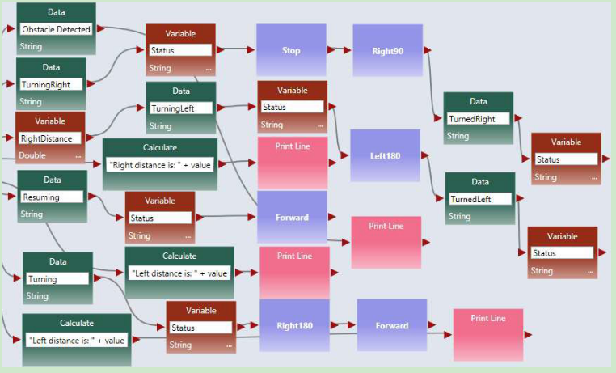

**Figure 4.15.** Processing the four cases

###Exercises 3. Implementing the Activities Used in the ASU VIPLE Program

There are six activities are implemented to support the main diagram: Init, Forward, Right90, Stop, Left180, and Right180. Consider each as an exercise.

Figure 4.16 shows the codes of four of these activities: Init, Forward, Right90, and Stop. The codes of the Right180 and Left180 are similar to Right90, but with different values.  Right click the Robot Drive services in each activity to enter their values as follows:

* In Forward: Set the Robot Drive values to 0.4 for both wheels.
* In Right90: Set the first Robot Drive values to 0.4 and -0.4 for left and right wheels, respectively. Set the second Robot Drive value to 0.0 for both wheels to make sure the robot make a full stop before taking the next action.
* In Right180: The code is the same as Right90, but set the first Timer value to 1900, instead of 950.
* In Left180: The code is the same as Right180, but set the first Robot Drive values to -0.4 and 0.4 for left and right wheels, instead.
* In Stop: Set the Robot Drive value to 0.0 for both wheels.

These values are reference vales. You need to adjust the values when you test your robot to make the correct timing and correct degree of turning.

**Figure 4.16.** Codes for Init, Forward, Right90, and Stop

The video of the robot’s navigating the maze and other resources can be found in the ASU VIPLE site: http://neptune.fulton.ad.asu.edu/VIPLE/

The full code of maze navigation program of the robot’s navigating the maze is available for instructors.

###Exercises 4. Using a simplified finite state machine

In the aforementioned implementation, the robot compare the left distance and right distance to make the decision. You can simply the decision making process in certain maze to use one distance value only. If the measured distance is greater than a certain value, the robot simply move to the current direction. Otherwise, spin 180 degree and move to the opposite direction without further measuring the distance. Figure 4.17 show the simplified finite state machine.

**Figure 4.17.** Simplified finite state machine using one distance value 

Implement the finite state machine for better performance.

##4.5 Implementing maze navigation using event-driven programming

Thus far, our algorithms have been implemented mainly using sequential programming, except the predefined key press events and robot sensor events. Defining our own set of events provides several advantages, including clearer code and better support parallel processing. In addition, using events allows us to more closely represent the original finite state machine. Some of the transitions in the finite state machine are actually events, rather than user input. In this section, we will redesign the foregoing wall-following program using event-driven programming. The finite state machine for the program is shown in Figure 4.5.

###Exercise 1. Redesign Left90 activity using event-driven programming style

We start with turning “Left90” activity. We are supposed to move to “Turned Left 90” and “Forward” after the “leftFinished” event triggers. Figure 4.18 demonstrates the changes required to define this event. Inside the “Left90” activity, we will draw a line to the circle output port instead of the triangle output port. The circle represents an event and declares that we want to trigger an event when we are done turning left 90. Since we are not drawing a line to the triangle, the activity block will never output a value to an activity connected sequentially after the “Left90” activity.

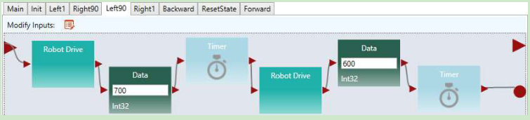

**Figure 4.18.** Adding an event trigger in the “Left90” activity

###Exercise 2. Redesign Left1 and Right90 using event-driven programming style

Figure 4.19 shows the redesigned “Left1” and “Backward” activities.

**Figure 4.19.** Adding an event trigger in the “Left1” and “Backward” activities 

###Exercise 3. Redesign the other activities using event-driven programming style 

Make similar changes in the “Right90” and “Right1” activities.

###Exercise 4. The Main diagram based on the event-driven activities

Now that we have defined our events in the activities, we need to update the Main diagram to handle the events. An event handler is a piece of code which is executed whenever a certain event occurs. We can define a custom event handler for our events using the “Custom Event” activity. By selecting one of our activity blocks in the drop down menu, we can handle any events triggered by that activity block.

For example, if we select “Left90” in the “Custom Event” activity’s drop down box, the code following that “Custom Event” activity will execute immediately after the code shown in Figure 4.8 reaches the circle pin. Figure 4.20 shows the updated program which uses events to transition between states instead of sequential programming. We also used a “Merge” activity to avoid repeating the “ResetState” activity. 

**Figure 4.20.** The right wall-following algorithm with custom events

##4.6 Implementing sumo robot

Before you program your sumo-robot, you need to install a light sensor in the front part of you robot and face to the floor. In order to read the black ring outside the sumo-ring, the light sensor must be so close to the floor, that you cannot insert more than two coins below the color sensor.

###Exercise 1. Basic sumo-robot program

The light Sensor measures the light intensity, which enables your robot to distinguish between light and dark and different colors. The code below shows that simple code that can detect the black ring of the white sumo board.

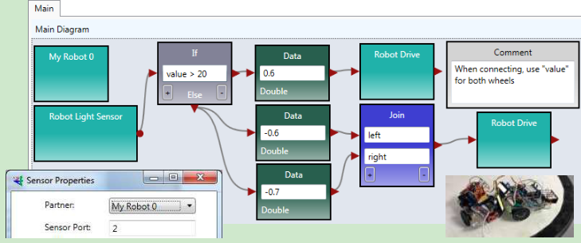

**Figure 4.21.** Basic program for sumo robot

The basic sumo robot algorithm using a single sensor (light sensor) can be described as follows.

**Sumo Algorithm 1: Basic Sumo with Light Sensor, with the Light Sensor Installed Faced to Floor**

1. The robot moves forward;

2. If the light sensor detect a color change (an event that the robot runs into the edge ring), the robot stops;

3. It moves backward for certain distance;

4. It turns a random number of degrees;

5. It returns (loops) to step 1.

###Exercise 2. Advanced sumo-robot program

To improve the performance of the sumo robot, you can use a touch sensor in addition to the light sensor. When the touch sensor is pressed, your sumo robot should move against that direction. You can also use an ultrasonic sensor to detect the opponent and turn the direction where the ultrasonic sensor detects a distance change.

For more detail of the advanced sumo-robot algorithms, please read the sumo-robot section in EV3 robot, where two additional algorithms are given.

#Chapter 5
#Controlling EV3 Robots Using ASU VIPLE

In this chapter, we start to use ASU VIPLE to write programs to control EV3 robots. Before we start to program, we need to build the robot. You can build your robot use the book in the EV3 box, or follow the link: http://robots2doss.org/?p=133

##5.1  Working with EV3 robots

###Exercise 1. Finding sensor reading from EV3 Brick

Before we program the sensors into our application, we should test all physical sensors and make sure they work as expected.

For color sensor and the ultrasonic sensor, sensor reading values (light reflection from the floor and the distance to the obstacle) can be found from EV3 brick. You can use the EV3 button and screen to do the calibration. As shown in Figure 5.1, first, have the color sensor face the floor, use the left-button to select the third tag, and then, select “Port View”. It will show the sensor reading value. Then, move the color sensor head to the black line, and repeat the process to read reflection value. Move to the next port, you will see the ultrasonic sensor reading value.

**Figure 5.1.** View sensor reading values from EV3 Brick screen

###Exercise 2. Finding sensor reading by a program

You can write an ASU VIPLE program to find the sensory value. Figure 5.2 shows the code for EV3 sensors. A similar program can be written for Edison robots. We will test the motors in the next exercise.

**Figure 5.2.** View sensor reading values using s program 

For EV3 or Edison robot, adding more sensors into the program and test them.  

###Exercise 3. Connecting robot to Computer via Bluetooth or Wi-Fi

To make the diagram in Figure 5.2 work with a physical robot, we need to configure the devices used in
the diagram in a number of steps.

**Step 1:** Configure the EV3 brick. Similar to the Microsoft VPL code, we use a main brick, called My EV3 Brick, to define the major configuration. It is possible to add more than one brick into a diagram. Right- click the brick to open the configuration. Figure 5.3 shows the right-click window and the two configuration windows. Change Connection Type window allows us to choose one of three available connection methods: Wi-Fi, Bluetooth, and USB. If Bluetooth is selected, the standard Bluetooth pairing process can be used to establish the connection between the computer running the ASU VIPLE program and the robot.

**Figure 5.3.** Configuration of the EV3 brick using Bluetooth connection

**Step 2:** Configure the other devices. For each device, we need to choose the partner and choose the connection ports that the devices use. There is one device used in this diagram: the Drive service. Figure
5.4shows the right-click window to the EV3 Drive service. The configuration sets the Drive service to partner with My EV3 Brick 0, and we assume that the Drive wheels are connected to the motor ports B and C on the EV3 Brick 0, respectively.

**Figure 5.4** Configuration of the EV3 brick

Step 3: Establish the connection. We assume that Bluetooth connection is selected. Bluetooth connection process depends on the Bluetooth device installed on your computer. A typical process consists of the following steps:

(1)Open the Bluetooth panel from the computer’s Task Bar, and choose Add a Device.

(2)The Bluetooth panel will show the devices that are ready to add. Find the EV3 robot that you want to add. Note, you can see the robot name on your EV3. You can also change name to make it unique.

(3)Once the add request is issued from the computer, the EV3 side will pop up a confirmation check box. Confirm it. EV3 will further generate a pass code 1234. Confirm the code again.

(4)On the computer side, a textbox will then pop up. Enter the pass code 1234 to connect.

(5)After the connection, we still need to know the “Outgoing” COM port of the connection. This port needs to be entered into the Property window in My EV3 Brick 0, as shown in Figure 6. To find the COM port, open the Bluetooth panel from the Task Bar and choose Open Bluetooth Settings.     We will see the COM Ports, as shown in Figure 5.5.

**Figure 5.5.** Find the COM port for My EV3 Brick 0 configuration

Once the configuration is completed, we can start to run the program and use the keyboard to drive the robot forward, backward, left, right, and stop.

We do not use Wi-Fi here. However, if Wi-Fi is selected for connection, as shown in Figure 5.6, we need to find the IP address of the robot and enter it into the Properties window so that the ASU VIPLE program can establish the Wi-Fi connection to the robot. Using the buttons and the screen on EV3, you can choose the Wi-Fi network to connect to and find the IP address after the connection.

**Figure 5.6.** Configuration of the robot using Wi-Fi connection

##5.2Remote control of EV3 robots

###Exercise 1. Drive-EV3-by-wire in ASU VIPLE

Figure 5.7 shows the program that remotely controls an EV3 robot using the four arrow keys on the computer’s keyboard. The Key Press Events are services that offer the same functionality as that of the Direction Dialog in Microsoft VPL. As we can define the key individually and we can define more than four keys, using Key Press Events is more flexible than using Direction Dialog.

Quiz 1: How do you make the robot to turn left? How do you make the robot to turn right? 

Quiz 2: What could be a problem in driving the robot using this program?

**Figure 5.7.** Drive an EV3 robot by wire

###Exercise 2. Improving the Driving Experience

It is hard to control the robot using the program in the previous exercise. The main problem is that the robot does not stop or slow down when the key is released. We can improve it by removing the drive power when the key is released, as shown in Figure 5.8.

**Figure 5.8.** ASU VIPLE program drive-by-wire using key press events, with key release programmed Quiz: What does the Print Line service do in this program?

##5.3Line-following program in ASU VIPLE

###Exercise 1. Installing a color sensor

Before you can write the line-following program, you need to install a color sensor (or a light sensor) on your robot. The senor head must face to the floor, so that the robot can recognize the line and move following the line on the floor. The distance between the color sensor’s head and the floor must be between one or two coin’s thicknesses, so that the color sensor can better read the light reflection from the floor. Depending on the color of the floor (background) and the color of the line, you need to calibrate and find the good reflection values. You can use the buttons and screen on EV3 brick to do the sensor value calibration, as discussed in Section 5.1.

###Exercise 2. Line-follower

Figure 5.9 shows ASU VIPLE code that makes the EV3 follow a black line on the light-brown floor. The initial position of the color sensor is on the black line or on the right side of black line. The If-activity

checks the sensor reading. If the reflection value is less than 20 (reading from black line), and the robot is not in Adjusting state, the robot will turn right for 200 milliseconds and then move straight forward. This action will make the robot moving away from the black line, resulting the sensor reading value to be greater than 20. In this case, the robot will turn left and move towards the black line. When the sensor sees the black line, it starts to move away from the black line. The variable Adjusting is used to make sure that the robot completes the 200 milliseconds adjustment before it turns right.

The program does not have a loop. It is event-driven. The event source is the color sensor, which generates events periodically. Whenever an event happens, the If-activity will be triggered and executed.

**Figure 5.9.** The line follower program in ASU VIPLE

Figure 5.10 shows the color sensor properties and the three EV3 Drive power values that control the robot turning right, moving straightforward, and turning left.

**Figure 5.10.** Sensor properties and the Drive power settings

##5.4Sumo Robot Programming

Before you program your sumo-robot, install the color sensor in the front part of you robot and face to the floor. In order to read the black ring outside the sumo-ring, the color sensor must be so close to the floor, that you cannot insert more than two coins below the color sensor.

###Exercise 1: Basic Sumo-Robot Algorithm

The color Sensor measures the light intensity, which enables your robot to distinguish between light and dark and different colors. The code below shows that simple code that can detect the black ring of the white sumo board.

**Figure 5.11.** Basic program for sumo robot

The basic sumo robot algorithm using a single sensor (color sensor) can be described as follows.

**Sumo Algorithm 1: Basic Sumo with Light Sensor, with the Light Sensor Installed Faced to Floor**

6. The robot moves forward;
7. If the light sensor detect a color change (an event that the robot runs into the edge ring), the robot stops;
8. It moves backward for certain distance;
9. It turns a random number of degrees;
10. It returns (loops) to step 1.

To improve the performance of the sumo robot, you can use a touch sensor in addition to the color sensor. When the touch sensor is pressed, your sumo robot should move against that direction. You can also use an ultrasonic sensor to detect the opponent. The following algorithms give you the ideas how you can program a winning sumo-robot.

###Exercise 2: Adding a touch sensor to the sumo-robot

The algorithm in Exercise 1 is random and hopes to push the opponent out of the ring by chance. By adding more sensors into the robot, your sumo robot will have a better chance to win. The following algorithm assumes that a touch sensor is installed as the rear bumper of the robot to detect the attacks from the behind.

**Sumo Algorithm 2: Sumo Using Light Sensor and Touch Sensor**

1. The robot moves forward;

2. If the touch sensor is pressed, robot moves backwards, trying to counter push the opponent. You may consider to spin 180 degree to attack the opponent use your font effector!
3. If the touch sensor is released, robot stops and returns to step 1. As your robot does you have a light sensor at the rear end, backward moving may easily moves out of the ring.
4. If the light sensor detect a color change, the robot stops;
5. It moves backward certain distance;
6. It turns a random number of degrees;
7. It returns (loops) to step 1.

This algorithm will avoid the robot being pushed out of the ring from the behind.

###Exercise 3: Adding the ultrasonic sensor to the sumo-robot

Furthermore, an ultrasonic sensor can be added on the left (or right) side of the robot to detect the opponent and attack the opponent proactively.

**Sumo Algorithm 3: Sumo Using Light Sensor, Touch Sensor, and Ultrasonic Sensor**

1. The robot moves forward;
2. If the ultrasonic sensor reading distance < 200,   turn 90 degree left (or right if the sensor is installed on the right side), and then return to step 1, trying to attack the opponent.8.   If the touch sensor is pressed, robot moves backwards, trying to counter push the opponent. You may consider to spin 180 degree to attack the opponent use your font effector!
3. If the touch sensor is released, robot stops and returns to step 1. As your robot does you have a light sensor at the rear end, backward moving may easily moves out of the ring.
4. If the light sensor detect a color change, the robot stops;
5. It moves backward certain distance;
6. It turns a random number of degrees;
7. It returns (loops) to step 1.

##5.5Wall-following program in ASU VIPLE

Before you start write the program, you need to install two sensors on your robot. A distance sensor facing the right-side (for following the right-side wall) of the wall and a touch sensor in the front of the robot.

###Exercise 1. EV3 Robot Wall-following maze navigation in ASU VIPLE (main diagram)

First, we define the right-wall-following algorithm using the finite state machine in Figure 5.11.

**Figure 5.11.** Finite state machine describing the right-wall-following algorithm

Two variables are used. An integer type variable BaseDistance stores the desired distance to the wall, which is initialized to 50 millimeter or the initial measurement of the range sensor. A string variable Status is used to store the moving status of the robot, and it is initialized to “Forward.” The Status variable can take one of these values: “Forward,” TurningLeft,” “TurnedLeft,” “TurningRight,” and “TurnedRight.” We do not need a status value for turning “Left 1 degree” or “Right 1 degree,” as these two actions can be done instantly, and other actions do not need to coordinate with these two status. The execution process can be described in the following algorithm.

4. Variable BaseDistance = 400 (or initially measured distance);
5. The robot repeats all the following steps in a loop, until the touch-sensor-pressed event occurs;
 * Status = “Forward”; Robot moves forward;

 * Robot keeps measures the right side-distance in certain interval defined by polling frequency, and it compares the newly measured distance with the distance stored in variable BaseDistance;

 * If the distance measured is less than BaseDistance - 5, the robot turns one degree left, and then returns to step 2;

 * If the distance measured is greater than BaseDistance + 5, turns one degree right, and then returns to step 2;

 * If the distance measured greater than BaseDistance + 200,  Status = “TurningRight90”; start to turn 90 degree right; after turning, Status = “TurnedRight”; and then returns to step 2;

6. Touch sensor is pressed; robot moves backward 0.5 rotations, Status = “TurningLeft90”; start to turn 90 degree left; after turning, Status = “TurnedLeft”; and then returns to step 2;

Following the finite state machine, we now can write the code for a robot to autonomously navigate through a maze. Figure 5.12 shows the main diagram that implements the finite state machine. A main brick, an ultrasonic sensor, a touch sensor, and a drive service are used in the program.

**Figure 5.12.** The main diagram of the right wall-following program

###Exercise 2. Write the Init Activity

**Figure 5.13.** The Init Activity

###Exercise 3. Write the Left1 Activity

The data connection for the two driver services are as follows.

**Figure 5.14.** The Left1 Activity and Data Connection

###Exercise 4. Write the Right90 Activity

The data connection for the two driver services are as follows.

**Figure 5.15.** Right90 Activity and Data Connection

###Exercise 5. Write the Left90 Activity

Based on the code Right90 to implement the Left90

###Exercise 6. Write the Right1 Activity 

Based on the code Left1 to implement the Right1 

###Exercise 7. Write the Backward Activity
Use negative power for both wheels

**Figure 5.16.** Backwards Activity

###Exercise 8. Write the ResetState Activity

**Figure 5.17.** ResetState Activity

###Exercise 9. Write the Forward Activity

**Figure 5.18.** Forward Activity and Data Connection

###Exercise 10. Configure Sensors in Wall-following maze navigation in ASU VIPLE

Similar to Microsoft VPL, activities that define components can be defined in ASU VIPLE. In the previous exercises, the codes of the activities, Init, Backward, and Left1 are developed.

For each sensor, we need to choose the partner and choose the sensor port that the device uses. For the main brick and the drive service, the same configurations are used as used in Figure 6, Figure 7, and Figure 8. Figure 5.19 shows the right-click window to configure the EV3 Ultrasonic distance sensor and the Touch sensor, respectively. The configurations assume that all the devices will partner with My EV3

Brick 0, the Ultrasonic sensor is connected to senor port 3, and the Touch sensor is connected to senor port 4 on the EV3 Brick.

**Figure 5.19.** Configurations of the EV3 Ultrasonic sensor and Touch sensor

The full code of right wall-following program and the video of the robot’s navigating the maze, as well as other sample code, can be found in the ASU VIPLE site:  http://neptune.fulton.ad.asu.edu/VIPLE.

##5.6 Wall-following program using event-driven programming style

Thus far, our algorithms have been implemented mainly using sequential programming, except the predefined key press events and robot sensor events. Defining our own set of events provides several advantages, including clearer code and better support parallel processing. In addition, using events allows us to more closely represent the original finite state machine. Some of the transitions in the finite state machine are actually events, rather than user input. In this section, we will redesign the foregoing wall-following program using event-driven programming.

###Exercise 1. Redesign Left90 activity using event-driven programming style

We start with turning “Left90”. We are supposed to move to “Turned Left 90” and “Forward” after the “leftFinished” event triggers. Figure 5.20 demonstrates the changes required to define this event. Inside the “Left90” activity, we will draw a line to the circle output port instead of the triangle output port. The circle represents an event and declares that we want to trigger an event when we are done turning left
90. Since we are not drawing a line to the triangle, the activity block will never output a value to an activity connected sequentially after the “Left90” activity.

**Figure 5.20.** Adding an event trigger in the “Left90” activity

###Exercise 2. Redesign the other activities using event-driven programming style

Make similar changes in the “Left1,” “Right90,” “Right1,” and “Backward” activities.

###Exercise 3. The Main diagram based on the event-driven activities

Now that we have defined our events in the activities, we need to update the Main diagram to handle the events. An event handler is a piece of code which is executed whenever a certain event occurs. We can define a custom event handler for our events using the “Custom Event” activity. By selecting one of our activity blocks in the drop down menu, we can handle any events triggered by that activity block.

For example, if we select “Left90” in the “Custom Event” activity’s drop down box, the code following that “Custom Event” activity will execute immediately after the code shown in Figure 5.20 reaches the circle pin. Figure 5.21 shows the updated program which uses events to transition between states instead of sequential programming. We also used a “Merge” activity to avoid repeating the “ResetState” activity.

**Figure 5.21.** The right wall-following algorithm with custom events

##5.7 Maze navigation using local best heuristic algorithm

###Exercise 1. Implementing the Main diagram of the two distance algorithm

In this exercise, we use the maze navigation algorithm defined in the finite state machine defined in Figure 5.22. We will use ASU VIPLE to implement this heuristic algorithm. As ASU VIPLE is an event- driven language, it is the best way to specify the algorithm in a finite state machine. In the diagram, we use two variables. The variable “Status” can take six possible string-type values of Forward, TurningRight, TurnedRight, TurningLeft (Spin180), TurnedLeft, and Resume180. The int-type variable “RightDistance” is used to store the distance to the obstacle after the robot turned right.

**Figure 5.22.** State Diagram of a maze navigation algorithm

The finite state diagram in Figure 5.22 implements a heuristic algorithm. Notice that the EV3 robot we built can rotate the head, and thus, we can rotate the sensor without rotating the body of the robot.

The algorithm is said to be heuristic, because it cannot find a solution in all cases of mazes. However, it has a good chance to find a solution in most mazes, given the information available collected by a single range sensor.
Figure 5.23 shows the code of the Main diagram.

**Figure 5.23.** Main diagram

###Exercise 2. Implementing SensorRight90

As the distance sensor head rotates, instead of the robot body rotating, the code for implementing the SensorRight90 is shown as follows.

###Exercise 3. Implementing the other activities

Follow the example in the exercise above and the activity codes in the Chapter 3 to implement the rest of the activities.

Acknowledgment

The authors wish to acknowledge those who contributed and helped in conceptualization and development of ASU VIPLE. Particularly, Dr. Yann-Hang Lee co-advised some of the student teams working on the related projects. Garrett Drown developed the first version of the eRobotics visual programming tool. Garret Walliman implemented the second version of the visual programming language. Calvin Cheng helped in the early development of VIPLE and contributed the EV3 APIs for VIPLE. Tara De Vries contributed to the service integration of VIPLE development. Megan Plachecki, John Robertson, and Sami Mian contributed to the JSON interface design, the implementation of the middleware on the Edison robot, and the robot hardware design. Matthew De Rosa developed the VIPLE Unity simulator. Adam Lew, Joshua Owens, Ankit Patel, Harshil Patel, and Peter Tueller contributed to the Web simulator.

